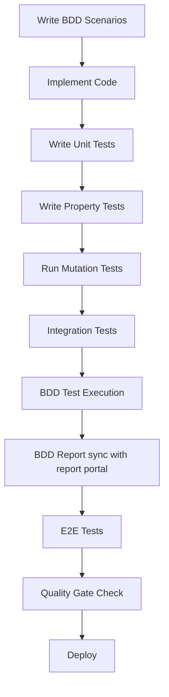

# Testing Standards and Practices

## Overview

This document defines mandatory testing standards, practices, and patterns for all OCP microservices. It establishes a comprehensive testing strategy that ensures code quality, correctness, and reliability across all development efforts.

## Core Testing Philosophy

### Comprehensive Testing Approach

All microservices **MUST** implement a comprehensive testing approach combining:

1. **Unit Tests**: Verify specific components with mocked dependencies
2. **Property-Based Tests**: Verify universal properties across all valid inputs
3. **BDD Tests (Reqnroll)**: Verify business requirements through executable specifications
4. **Mutation Tests (Stryker.NET)**: Verify test suite quality and effectiveness
5. **Reporting**: Report Test Executions in ReportPortal

This approach provides comprehensive coverage where unit tests catch concrete bugs, property tests verify general correctness, BDD tests ensure business requirements are met, and mutation tests validate test quality.

### Specific Feature Testing Approach
When the user asks you to implement or validate tests for a specific JIRA issue, for example: ARCXDAUGAI-XX, identify the business requirement and acceptance criteria and generate specific tests that cover this, in line with what is discussed in this document.


### Testing Pyramid

```
      /\
     /  \    E2E Tests (Few)
    /____\   
   /      \   Integration Tests (Some)
  /________\  BDD Tests (Moderate)
 /          \ Unit + Property Tests (Many)
/__________\  Mutation Tests (Quality Gate)
```

- **Unit + Property Tests (Many)**: Core logic, business rules, data transformations
- **BDD Tests (Moderate)**: Business scenarios, acceptance criteria, user workflows
- **Integration Tests (Some)**: Component interactions, database operations, external APIs
- **E2E Tests (Few)**: Critical user journeys, system-wide workflows
- **Mutation Tests (Quality Gate)**: Test suite effectiveness validation

## Mandatory Testing Requirements

### 1. Test Coverage Standards

**Minimum Coverage Requirements:**
- **Unit Tests**: 80% code coverage for business logic
- **Property Tests**: All universal properties identified in design documents
- **BDD Tests**: All acceptance criteria from requirements documents
- **Integration Tests**: All external dependencies and data flows
- **API Tests**: All public endpoints with success and error scenarios
- **Mutation Tests**: 80% mutation score for critical business logic

### 2. Test Organization

**New Consolidated Directory Structure:**
```
tests/                              # Consolidated testing directory
├── unit/                            # Unit tests (replaces {Service}.Api.BehaviouralTests)
│   ├── Controllers/                 # Controller unit tests
│   │   ├── InvoicesControllerTests.cs
│   │   ├── InvoicesV1ControllerTests.cs
│   │   └── PaymentsControllerTests.cs
│   ├── Services/                    # Service layer tests
│   │   ├── InvoiceServiceTests.cs
│   │   ├── PaymentServiceTests.cs
│   │   ├── ConcurrentRequestServiceTests.cs
│   │   └── RestValidationServiceTests.cs
│   ├── Repositories/                # Repository tests
│   │   ├── InvoiceRepositoryTests.cs
│   │   ├── PaymentRepositoryTests.cs
│   │   └── MessageRepositoryTests.cs
│   ├── Constructors/                # Constructor tests
│   │   └── InvoiceConstructorTests.cs
│   ├── Validators/                  # Validator tests
│   │   ├── InvoiceNumberValidatorTests.cs
│   │   └── OrderNumberValidatorTests.cs
│   ├── Middlewares/                 # Middleware tests
│   │   ├── CorrelationIdMiddlewareTests.cs
│   │   ├── ExceptionHandlingMiddlewareTests.cs
│   │   └── RequestDeduplicationMiddlewareTests.cs
│   ├── PropertyBased/               # Property-based tests
│   │   ├── RestApiPropertyTests.cs
│   │   ├── ConcurrentRequestPropertyTests.cs
│   │   ├── DataCompletenessPropertyTests.cs
│   │   └── InputValidationPropertyTests.cs
│   ├── Shared/                      # Shared test utilities
│   │   ├── Helpers/
│   │   │   ├── TestDataHelper.cs
│   │   │   └── PropertyTestGenerators.cs
│   │   ├── Mocks/
│   │   │   ├── MockInvoiceRepository.cs
│   │   │   ├── MockPaymentRepository.cs
│   │   │   └── MockServices.cs
│   │   └── TestData/
│   │       ├── InvoiceTestData.json
│   │       ├── PaymentTestData.json
│   │       └── MessageTestData.json
│   └── Ibs.Api.UnitTests.csproj     # Unit test project file
├── integration/                     # Integration tests
│   ├── Api/                         # API integration tests
│   │   ├── InvoiceEndpointsTests.cs
│   │   └── PaymentEndpointsTests.cs
│   ├── Database/                    # Database integration tests
│   │   ├── MongoDbIntegrationTests.cs
│   │   └── RepositoryIntegrationTests.cs
│   ├── Messaging/                   # Messaging integration tests
│   │   ├── NServiceBusIntegrationTests.cs
│   │   └── MessageHandlerTests.cs
│   ├── Shared/                      # Shared integration utilities
│   │   ├── Helpers/
│   │   │   ├── DatabaseHelper.cs
│   │   │   └── TestStartup.cs
│   │   └── TestData/
│   │       └── IntegrationTestData.json
│   └── Ibs.Api.IntegrationTests.csproj
├── bdd/                            # BDD tests (Reqnroll)
│   ├── Features/                    # Gherkin feature files
│   │   ├── InvoiceRetrieval.feature
│   │   ├── PaymentProcessing.feature
│   │   └── ErrorHandling.feature
│   ├── StepDefinitions/             # Step definition classes
│   │   ├── InvoiceSteps.cs
│   │   ├── PaymentSteps.cs
│   │   └── CommonSteps.cs
│   ├── Drivers/                     # Driver pattern implementations
│   │   ├── InvoiceTestDriver.cs
│   │   └── PaymentTestDriver.cs
│   ├── Support/                     # Support utilities
│   │   ├── InMemoryRepository.cs
│   │   └── TestConfiguration.cs
│   ├── Hooks/                       # Test hooks and setup
│   │   └── TestHooks.cs
│   ├── ReportPortal.json            #Configuration File for Report portal
│   └── Ibs.Api.BddTests.csproj
├── e2e/                            # End-to-end tests
│   ├── collections/                 # Postman collections
│   │   ├── ibs-basic-scenarios.postman_collection.json
│   │   └── ibs-comprehensive.postman_collection.json
│   ├── environments/                # Environment configurations
│   │   ├── local.postman_environment.json
│   │   ├── preprod.postman_environment.json
│   │   └── prod.postman_environment.json
│   ├── scripts/                     # E2E test scripts
│   │   ├── validate-basic-e2e.ps1
│   │   ├── validate-comprehensive-e2e.ps1
│   │   └── run-all-e2e.ps1
│   ├── data/                        # Test data management
│   │   ├── test-data-seeder.js
│   │   ├── seed-test-data.ps1
│   │   └── verify-test-data.ps1
│   ├── package.json
│   └── README.md
├── performance/                     # Performance tests
│   ├── load/                        # Load testing
│   │   ├── load-test-scenarios.js
│   │   └── stress-test-config.json
│   ├── benchmarks/                  # Benchmark tests
│   │   └── api-benchmarks.cs
│   └── Ibs.Api.PerformanceTests.csproj
├── mutation/                        # Mutation testing configuration
│   ├── stryker-config.json
│   ├── mutation-test-config.ps1
│   └── analyze-mutation-results.ps1
├── scripts/                         # Testing scripts
│   ├── build/                       # Build scripts
│   │   ├── build-all-tests.ps1
│   │   └── clean-test-artifacts.ps1
│   ├── run/                         # Test execution scripts
│   │   ├── run-unit-tests.ps1
│   │   ├── run-integration-tests.ps1
│   │   ├── run-bdd-tests.ps1
│   │   ├── run-e2e-tests.ps1
│   │   ├── run-mutation-tests.ps1
│   │   └── run-all-tests.ps1        # Master test runner
│   ├── infrastructure/              # Infrastructure setup
│   │   ├── setup-test-environment.ps1
│   │   ├── mongo-init.js
│   │   └── docker-test-services.yml
│   └── reporting/                   # Test reporting
│       ├── generate-test-report.ps1
│       ├── merge-coverage-reports.ps1
│       └── publish-test-results.ps1
├── results/                         # Test results (replaces TestResults)
│   ├── unit/
│   ├── integration/
│   ├── bdd/
│   ├── e2e/
│   ├── mutation/
│   ├── performance/
│   └── coverage/
├── config/                          # Testing configuration
│   ├── test-settings.json
│   ├── coverage-config.json
│   └── ci-pipeline-config.yml
└── README.md                        # Testing documentation
```

When you create this projects to ensure these are added to the solution file as referenced project

### 3. Test Naming Conventions

**Unit Tests:**
```csharp
[Test]
public void MethodName_Scenario_ExpectedBehavior()
{
    // Example: GetInvoiceByNumber_ValidInvoice_ReturnsSuccessResponse
}
```

**Property Tests:**
```csharp
[Test]
public void PropertyName_ShouldHoldUniversally_ForAllValidInputs()
{
    // **Feature: {feature-name}, Property {number}: {property-description}**
    // **Validates: Requirements {requirement-ids}**
}
```

**BDD Tests (Reqnroll):**
```csharp
[Binding]
public class InvoiceRetrievalSteps
{
    // **Feature: invoice-management, Scenario: Retrieve invoice by valid order number**
    // **Validates: Requirements 1.1, 1.2**
    
    [Given(@"an invoice exists with order number ""(.*)""")]
    public void GivenAnInvoiceExistsWithOrderNumber(string orderNumber)
    {
        // Step implementation
    }
    
    [When(@"I request the invoice for order number ""(.*)""")]
    public void WhenIRequestTheInvoiceForOrderNumber(string orderNumber)
    {
        // Step implementation
    }
    
    [Then(@"I should receive the invoice details")]
    public void ThenIShouldReceiveTheInvoiceDetails()
    {
        // Step implementation
    }
}
```

**Integration Tests:**
```csharp
[Test]
public void Workflow_Scenario_ExpectedOutcome()
{
    // Example: InvoiceRetrieval_ExistingInvoice_ReturnsCompleteData
}
```

## Property-Based Testing Standards

### 1. Property Identification

During design phase, **MUST** complete prework analysis for all acceptance criteria:

```markdown
## Acceptance Criteria Testing Prework

X.Y Criteria Name
  Thoughts: step-by-step analysis of testability
  Testable: yes - property | yes - example | no | edge-case
```

### 2. Property Implementation Requirements

**Library Selection:**
- **.NET**: FsCheck (mandatory)
- **.NET**: Moq (mandatory)
- **.NET**: NUnit.Framework  (mandatory)
- **.NET**: Shouldly (mandatory)
- **.NET**: ReportPortal.Reqnroll (mandatory in the BDD test project)
- **.NET**: ReportPortal.Nunit (mandatory in the Unit test project)

**Configuration:**
- **Minimum Iterations**: 100 per property test
- **Test Tagging**: Must include feature and property references
- **Generator Quality**: Use smart generators that constrain input space appropriately

**Example Implementation:**
```csharp
[Test]
public void GetInvoiceByNumber_ShouldReturnConsistentFormat_ForAnyValidRequest()
{
    // **Feature: sfsc-adapter-integration, Property 2: REST Response Format Consistency**
    // **Validates: Requirements 2.4**
    
    Prop.ForAll(
        GenerateValidInvoiceNumbers(),
        invoiceNumber =>
        {
            // Act
            var result = _controller.GetInvoiceByNumber(invoiceNumber).Result;
            
            // Assert - Universal property verification
            VerifyApiResponseFormat(result);
            return true;
        })
        .QuickCheckThrowOnFailure();
}
```

### 3. Property Categories

**Common Property Patterns:**

1. **Invariants**: Properties preserved after transformations
   ```csharp
   // Example: Collection size after map operation
   collection.Map(f).Count == collection.Count
   ```

2. **Round Trip Properties**: Operation + inverse returns original
   ```csharp
   // Example: Serialization/deserialization
   Deserialize(Serialize(obj)) == obj
   ```

3. **Idempotence**: Doing operation twice equals doing it once
   ```csharp
   // Example: Distinct filter
   collection.Distinct().Distinct() == collection.Distinct()
   ```

4. **Metamorphic Properties**: Relationships between inputs/outputs
   ```csharp
   // Example: Filter reduces size
   collection.Filter(predicate).Count <= collection.Count
   ```

## Property-Based Testing Implementation Patterns

### 1. Domain-Specific Generators

**Order Number Generators:**
```csharp
public static class OrderNumberGenerators
{
    // Generate valid EcomOrder numbers (0 + 9 digits)
    public static Gen<string> ValidEcomOrderNumbers()
    {
        return from digits in Gen.Choose(100000000, 999999999)
               select $"0{digits}";
    }

    // Generate valid ManualOrder numbers (GS + 8 digits)
    public static Gen<string> ValidManualOrderNumbers()
    {
        return from digits in Gen.Choose(10000000, 99999999)
               select $"GS{digits}";
    }

    // Generate valid MaoOrder numbers (21 digits)
    public static Gen<string> ValidMaoOrderNumbers()
    {
        return from number in Gen.Choose(100000000000000000000L, 999999999999999999999L)
               select number.ToString();
    }

    // Generate valid ReplacementOrder numbers (18 + 8 digits)
    public static Gen<string> ValidReplacementOrderNumbers()
    {
        return from digits in Gen.Choose(10000000, 99999999)
               select $"18{digits}";
    }

    // Generate valid RegearOrder numbers (8 alphanumeric)
    public static Gen<string> ValidRegearOrderNumbers()
    {
        return from chars in Gen.ArrayOf(8, Gen.Elements("ABCDEFGHIJKLMNOPQRSTUVWXYZ0123456789"))
               select new string(chars);
    }

    // Combined generator for any valid order number
    public static Gen<string> ValidOrderNumbers()
    {
        return Gen.OneOf(
            ValidEcomOrderNumbers(),
            ValidManualOrderNumbers(),
            ValidMaoOrderNumbers(),
            ValidReplacementOrderNumbers(),
            ValidRegearOrderNumbers()
        );
    }

    // Generate invalid order numbers for negative testing
    public static Gen<string> InvalidOrderNumbers()
    {
        return Gen.OneOf(
            Gen.Constant(""), // Empty
            Gen.Constant("   "), // Whitespace
            Gen.Constant("INVALID"), // Wrong format
            Gen.Constant("123"), // Too short
            Gen.Constant("0123456789012345678901234567890"), // Too long
            Gen.Elements("@#$%^&*()") // Invalid characters
        );
    }
}
```

**Invoice Number Generators:**
```csharp
public static class InvoiceNumberGenerators
{
    // Generate valid SAP invoice numbers (10 digits)
    public static Gen<string> ValidSapInvoiceNumbers()
    {
        return from number in Gen.Choose(1000000000L, 9999999999L)
               select number.ToString();
    }

    // Generate valid MAO invoice numbers (19+ digits)
    public static Gen<string> ValidMaoInvoiceNumbers()
    {
        return from length in Gen.Choose(19, 25)
               from digits in Gen.ListOf(length, Gen.Choose(0, 9))
               select string.Join("", digits);
    }

    // Combined generator for valid invoice numbers
    public static Gen<string> ValidInvoiceNumbers()
    {
        return Gen.OneOf(
            ValidSapInvoiceNumbers(),
            ValidMaoInvoiceNumbers()
        );
    }
}
```

### 2. Correlation ID Property Testing

**Correlation ID Propagation Properties:**
```csharp
[Test]
public void CorrelationId_ShouldPropagate_ThroughAllApiCalls()
{
    // **Feature: api-tracing, Property 1: Correlation ID Propagation**
    // **Validates: Requirements TRACE-1.1, TRACE-1.2**
    
    Prop.ForAll(
        Gen.NonEmptyString.Where(s => Guid.TryParse(s, out _)), // Valid GUID strings
        OrderNumberGenerators.ValidOrderNumbers(),
        (correlationId, orderNumber) =>
        {
            // Arrange
            var request = new HttpRequestMessage(HttpMethod.Get, $"/api/v1/orders/{orderNumber}/invoices");
            request.Headers.Add("X-Correlation-ID", correlationId);

            // Act
            var response = _httpClient.SendAsync(request).Result;
            var content = response.Content.ReadAsStringAsync().Result;
            var apiResponse = JsonSerializer.Deserialize<ApiResponse<InvoiceRestModel>>(content);

            // Assert - Correlation ID should be preserved
            if (response.IsSuccessStatusCode)
            {
                apiResponse.CorrelationId.ShouldBe(correlationId);
            }
            
            return true;
        })
        .QuickCheckThrowOnFailure();
}
```

### 3. API Response Format Properties

**Response Structure Consistency:**
```csharp
[Test]
public void ApiResponse_ShouldHaveConsistentStructure_ForAllValidRequests()
{
    // **Feature: api-consistency, Property 2: Response Format Consistency**
    // **Validates: Requirements API-2.1, API-2.2**
    
    Prop.ForAll(
        OrderNumberGenerators.ValidOrderNumbers(),
        orderNumber =>
        {
            // Act
            var response = _controller.GetInvoiceByOrderNumber(orderNumber).Result;

            // Assert - Universal response structure properties
            if (response.Result is OkObjectResult okResult)
            {
                var apiResponse = okResult.Value as ApiResponse<InvoiceRestModel>;
                apiResponse.ShouldNotBeNull();
                apiResponse.Success.ShouldBeTrue();
                apiResponse.CorrelationId.ShouldNotBeNullOrEmpty();
                apiResponse.Data.ShouldNotBeNull();
            }
            else if (response.Result is NotFoundObjectResult notFoundResult)
            {
                var apiResponse = notFoundResult.Value as ApiResponse<InvoiceRestModel>;
                apiResponse.ShouldNotBeNull();
                apiResponse.Success.ShouldBeFalse();
                apiResponse.CorrelationId.ShouldNotBeNullOrEmpty();
                apiResponse.Message.ShouldNotBeNullOrEmpty();
            }
            
            return true;
        })
        .QuickCheckThrowOnFailure();
}
```

### 4. Business Rule Properties

**Order Number Validation Properties:**
```csharp
[Test]
public void OrderNumberValidation_ShouldRejectInvalidFormats_Consistently()
{
    // **Feature: input-validation, Property 3: Order Number Format Validation**
    // **Validates: Requirements VAL-1.1, VAL-1.2**
    
    Prop.ForAll(
        OrderNumberGenerators.InvalidOrderNumbers(),
        invalidOrderNumber =>
        {
            // Act
            var response = _controller.GetInvoiceByOrderNumber(invalidOrderNumber).Result;

            // Assert - Invalid order numbers should always be rejected
            response.Result.ShouldBeOfType<BadRequestObjectResult>();
            
            var badRequestResult = response.Result as BadRequestObjectResult;
            var apiResponse = badRequestResult.Value as ApiResponse<InvoiceRestModel>;
            
            apiResponse.Success.ShouldBeFalse();
            apiResponse.Message.ShouldContain("Invalid order number format");
            
            return true;
        })
        .QuickCheckThrowOnFailure();
}
```

### 5. Property Test Configuration

**FsCheck Configuration for Domain Testing:**
```csharp
public static class PropertyTestConfig
{
    public static Configuration DomainTestConfig => Configuration.Default
        .WithMaxTest(200) // Increased iterations for domain-critical properties
        .WithStartSize(1)
        .WithEndSize(100)
        .WithQuietOnSuccess(false) // Show successful test details
        .WithReplay(Random.StdGen.NewStdGen(0, 0)); // Reproducible tests

    public static Configuration QuickTestConfig => Configuration.Default
        .WithMaxTest(50) // Fewer iterations for quick feedback
        .WithStartSize(1)
        .WithEndSize(50)
        .WithQuietOnSuccess(true);
}

// Usage in tests
[Test]
public void PropertyTest_WithDomainConfig()
{
    Prop.ForAll(
        OrderNumberGenerators.ValidOrderNumbers(),
        orderNumber => {
            // Property test logic
            return true;
        })
        .Check(PropertyTestConfig.DomainTestConfig);
}
```

### 6. Property Test Debugging

**Property Test Failure Analysis:**
```csharp
[Test]
public void PropertyTest_WithDebugging()
{
    var property = Prop.ForAll(
        OrderNumberGenerators.ValidOrderNumbers(),
        orderNumber =>
        {
            try
            {
                // Property test logic
                var result = _service.ProcessOrderNumber(orderNumber);
                return result.IsValid;
            }
            catch (Exception ex)
            {
                // Log failure details for debugging
                Console.WriteLine($"Property test failed for order number: {orderNumber}");
                Console.WriteLine($"Exception: {ex.Message}");
                Console.WriteLine($"Stack trace: {ex.StackTrace}");
                throw;
            }
        });

    // Use custom configuration with detailed output
    property.Check(Configuration.Default
        .WithMaxTest(100)
        .WithQuietOnSuccess(false)
        .WithEvery((testNumber, args) =>
        {
            Console.WriteLine($"Test #{testNumber}: {string.Join(", ", args)}");
            return "";
        }));
}
```

### 7. Property Test Integration with CI/CD

**Property Test Reporting:**
```csharp
[Test]
public void PropertyTest_WithReporting()
{
    var results = new List<PropertyTestResult>();
    
    var property = Prop.ForAll(
        OrderNumberGenerators.ValidOrderNumbers(),
        orderNumber =>
        {
            var startTime = DateTime.UtcNow;
            var success = false;
            string errorMessage = null;
            
            try
            {
                var result = _service.ProcessOrderNumber(orderNumber);
                success = result.IsValid;
                return success;
            }
            catch (Exception ex)
            {
                errorMessage = ex.Message;
                return false;
            }
            finally
            {
                results.Add(new PropertyTestResult
                {
                    Input = orderNumber,
                    Success = success,
                    Duration = DateTime.UtcNow - startTime,
                    ErrorMessage = errorMessage
                });
            }
        });

    property.QuickCheckThrowOnFailure();
    
    // Generate test report
    GeneratePropertyTestReport(results);
}

public record PropertyTestResult
{
    public string Input { get; init; }
    public bool Success { get; init; }
    public TimeSpan Duration { get; init; }
    public string ErrorMessage { get; init; }
}
```

## BDD Testing Standards (Reqnroll)

### 1. BDD Framework Integration

**Library Selection:**
- **Reqnroll**: Open-source Cucumber-style BDD framework for .NET (mandatory)
- **ReportPortal.Reqnroll**: ReportPortal integration for Reqnroll (mandatory)
- **ReportPortal.NUnit**: ReportPortal integration for NUnit (mandatory)
- **Test Runners**: NUnit, xUnit, or MSTest integration
- **Gherkin**: Feature file specification format

**Installation:**
```xml
<PackageReference Include="Reqnroll" Version="3.3.0" />
<PackageReference Include="Reqnroll.NUnit" Version="3.3.0" />
<PackageReference Include="Reqnroll.Tools.MsBuild.Generation" Version="3.3.0" />
<PackageReference Include="ReportPortal.Reqnroll" Version="1.5.0" />
<PackageReference Include="ReportPortal.NUnit" Version="4.8.0" />
```


### 4. Driver Pattern Implementation

**Test Driver Standards:**
```csharp
public class InvoiceTestDriver
{
    private readonly HttpClient _httpClient;
    private readonly IInvoiceRepository _repository;
    private readonly TestConfiguration _config;

    public InvoiceTestDriver(HttpClient httpClient, IInvoiceRepository repository, TestConfiguration config)
    {
        _httpClient = httpClient;
        _repository = repository;
        _config = config;
    }

    public async Task CreateInvoiceAsync(Invoice invoice)
    {
        await _repository.SaveAsync(invoice);
    }

    public async Task<ApiResponse<InvoiceModel>> GetInvoiceByOrderNumberAsync(string orderNumber)
    {
        var response = await _httpClient.GetAsync($"/api/invoices/order/{orderNumber}");
        var content = await response.Content.ReadAsStringAsync();
        return JsonSerializer.Deserialize<ApiResponse<InvoiceModel>>(content);
    }

    public async Task CleanupTestDataAsync()
    {
        // Cleanup logic for test isolation
    }
}
```

### 5. BDD Test Configuration

**Reqnroll Configuration:**
```json
{
  "reqnroll": {
    "language": {
      "feature": "en-US"
    },
    "bindingCulture": {
      "name": "en-US"
    },
    "runtime": {
      "dependencies": [
        {
          "type": "context-injection"
        }
      ]
    },
    "trace": {
      "traceSuccessfulSteps": true,
      "traceTimings": true,
      "minTracedDuration": "0:0:0.1"
    }
  }
}
```

**Report Portal Reqnroll Configuration:**

### 6. File name: ReportPortal.json

```json
{
  "$schema": "https://raw.githubusercontent.com/reportportal/agent-dotnet-reqnroll/master/src/ReportPortal.ReqnrollPlugin/ReportPortal.config.schema",
  "enabled": true,
  "server": {
    "url": "https://reportportal.epam.com/",
    "project": "YYY",
    "apiKey": "XXX"
  },
  "launch": {
    "name": "Reqnroll Demo Launch",
    "description": "this is description",
    "debugMode": true,
    "attributes": [ "t1", "os:win10" ]
  }
}
```

## BDD Testing Best Practices and Patterns

### 1. In-Memory Repository Pattern for BDD Tests

**Problem**: BDD tests should not depend on physical databases to ensure fast execution, test isolation, and avoid infrastructure dependencies.

**Solution**: Implement in-memory repositories that simulate database behavior without actual persistence.

**Implementation Pattern:**
```csharp
// In-Memory Repository Interface
public interface IInMemoryRepository<T>
{
    Task<T> GetByIdAsync(string id);
    Task<IEnumerable<T>> GetAllAsync();
    Task SaveAsync(T entity);
    Task DeleteAsync(string id);
    Task ClearAsync();
    Task<IEnumerable<T>> FindAsync(Expression<Func<T, bool>> predicate);
}

// In-Memory Invoice Repository Implementation
public class InMemoryInvoiceRepository : IInvoiceRepository
{
    private readonly Dictionary<string, Invoice> _invoices = new();
    private readonly List<string> _seededIds = new();

    public async Task<Invoice> GetByOrderNumberAsync(string orderNumber)
    {
        return await Task.FromResult(_invoices.Values.FirstOrDefault(i => i.OrderNumber == orderNumber));
    }

    public async Task SaveAsync(Invoice invoice)
    {
        _invoices[invoice.Id] = invoice;
        await Task.CompletedTask;
    }

    public async Task ClearSeededDataAsync()
    {
        // Only remove seeded test data, not all data
        foreach (var id in _seededIds.ToList())
        {
            if (_invoices.ContainsKey(id))
            {
                _invoices.Remove(id);
                _seededIds.Remove(id);
            }
        }
        await Task.CompletedTask;
    }

    public void TrackSeededId(string id)
    {
        if (!_seededIds.Contains(id))
        {
            _seededIds.Add(id);
        }
    }
}
```

### 2. Test Data Seeding Strategy

**Problem**: BDD tests need consistent, predictable test data that covers all business scenarios without creating data on-the-fly.

**Solution**: Implement a comprehensive seeding strategy that creates all necessary test data once at test run start.

**Seeding Implementation:**
```csharp
public class InMemoryDatabaseSeeder
{
    private readonly IInMemoryInvoiceRepository _invoiceRepository;
    private readonly IInMemoryPaymentRepository _paymentRepository;

    public async Task SeedTestDataAsync()
    {
        await SeedInvoicesAsync();
        await SeedPaymentsAsync();
    }

    private async Task SeedInvoicesAsync()
    {
        var invoices = new[]
        {
            CreateInvoice("0123456789", "1234567890", "EcomOrder"),      // Valid EcomOrder
            CreateInvoice("GS12345678", "9876543210", "ManualOrder"),    // Valid ManualOrder  
            CreateInvoice("123456789012345678901", "1111111111", "MaoOrder"), // Valid MaoOrder
            CreateInvoice("1812345678", "2222222222", "ReplacementOrder"), // Valid ReplacementOrder
            CreateInvoice("ABC12345", "3333333333", "RegearOrder")       // Valid RegearOrder
        };

        foreach (var invoice in invoices)
        {
            await _invoiceRepository.SaveAsync(invoice);
            _invoiceRepository.TrackSeededId(invoice.Id);
        }
    }

    private Invoice CreateInvoice(string orderNumber, string invoiceNumber, string orderType)
    {
        return new Invoice
        {
            Id = Guid.NewGuid().ToString(),
            OrderNumber = orderNumber,
            InvoiceNumber = invoiceNumber,
            OrderType = orderType,
            InvoiceDate = DateTime.UtcNow,
            Currency = "USD",
            TotalAmount = 100.00m
        };
    }
}
```

### 3. Selective Cleanup Strategy

**Problem**: Traditional database clearing approaches (`ClearDatabase()`) are too aggressive and can interfere with other tests or shared data.

**Solution**: Implement selective cleanup that only removes test-created data while preserving other data.

**Selective Cleanup Pattern:**
```csharp
[Hooks]
public class TestHooks
{
    private readonly InMemoryDatabaseSeeder _seeder;
    private readonly IInMemoryInvoiceRepository _invoiceRepository;
    private readonly IInMemoryPaymentRepository _paymentRepository;

    [BeforeTestRun]
    public static async Task BeforeTestRun()
    {
        // Seed data once for entire test run
        var seeder = TestServiceProvider.GetService<InMemoryDatabaseSeeder>();
        await seeder.SeedTestDataAsync();
    }

    [AfterScenario]
    public async Task AfterScenario()
    {
        // Only clean up data created during the scenario, not seeded data
        await CleanupScenarioDataAsync();
    }

    [AfterTestRun]
    public static async Task AfterTestRun()
    {
        // Clean up all seeded data at the end
        var invoiceRepo = TestServiceProvider.GetService<IInMemoryInvoiceRepository>();
        var paymentRepo = TestServiceProvider.GetService<IInMemoryPaymentRepository>();
        
        await invoiceRepo.ClearSeededDataAsync();
        await paymentRepo.ClearSeededDataAsync();
    }

    private async Task CleanupScenarioDataAsync()
    {
        // Remove only scenario-specific data, preserve seeded data
        // Implementation depends on tracking scenario-created entities
    }
}
```

### 4. Generic Step Definition Patterns

**Problem**: Duplicate step definitions across different feature files can cause ambiguous step definition errors.

**Solution**: Create generic, reusable step definitions that work across multiple scenarios.

**Generic Step Implementation:**
```csharp
[Binding]
public class CommonSteps
{
    private readonly ScenarioContext _scenarioContext;

    public CommonSteps(ScenarioContext scenarioContext)
    {
        _scenarioContext = scenarioContext;
    }

    [Then(@"the correlation ID should be present")]
    public void ThenTheCorrelationIdShouldBePresent()
    {
        // Generic correlation ID validation that works for any response type
        var response = _scenarioContext.Get<object>("ApiResponse");
        
        if (response is ApiResponse<InvoiceRestModel> invoiceResponse)
        {
            invoiceResponse.CorrelationId.ShouldNotBeNullOrEmpty();
        }
        else if (response is ApiResponse<PaymentModel> paymentResponse)
        {
            paymentResponse.CorrelationId.ShouldNotBeNullOrEmpty();
        }
        else
        {
            throw new InvalidOperationException($"Unsupported response type: {response.GetType()}");
        }
    }

    [Then(@"the response should indicate success")]
    public void ThenTheResponseShouldIndicateSuccess()
    {
        var response = _scenarioContext.Get<object>("ApiResponse");
        
        // Use reflection to check Success property on any response type
        var successProperty = response.GetType().GetProperty("Success");
        successProperty.ShouldNotBeNull("Response should have Success property");
        
        var success = (bool)successProperty.GetValue(response);
        success.ShouldBeTrue("Response should indicate success");
    }
}
```

### 5. Domain-Specific Validation Patterns

**Problem**: Different business domains require specific validation rules that must be consistently applied across tests.

**Solution**: Implement domain-specific validation patterns that encapsulate business rules.

**Domain Validation Implementation:**
```csharp
public static class OrderNumberValidation
{
    public static readonly Dictionary<string, Regex> OrderPatterns = new()
    {
        { "EcomOrder", new Regex(@"^0\d{9}$") },           // 0123456789
        { "ManualOrder", new Regex(@"^GS\d{8}$") },        // GS12345678
        { "MaoOrder", new Regex(@"^\d{21}$") },            // 123456789012345678901
        { "ReplacementOrder", new Regex(@"^18\d{8}$") },   // 1812345678
        { "RegearOrder", new Regex(@"^[a-zA-Z0-9]{8}$") } // ABC12345
    };

    public static bool IsValidOrderNumber(string orderNumber, string orderType = null)
    {
        if (string.IsNullOrEmpty(orderNumber))
            return false;

        if (orderType != null && OrderPatterns.ContainsKey(orderType))
        {
            return OrderPatterns[orderType].IsMatch(orderNumber);
        }

        // Check against all patterns if type not specified
        return OrderPatterns.Values.Any(pattern => pattern.IsMatch(orderNumber));
    }

    public static string GenerateValidOrderNumber(string orderType)
    {
        return orderType switch
        {
            "EcomOrder" => $"0{Random.Shared.Next(100000000, 999999999)}",
            "ManualOrder" => $"GS{Random.Shared.Next(10000000, 99999999)}",
            "MaoOrder" => Random.Shared.NextInt64(100000000000000000000L, 999999999999999999999L).ToString(),
            "ReplacementOrder" => $"18{Random.Shared.Next(10000000, 99999999)}",
            "RegearOrder" => GenerateAlphanumeric(8),
            _ => throw new ArgumentException($"Unknown order type: {orderType}")
        };
    }

    private static string GenerateAlphanumeric(int length)
    {
        const string chars = "ABCDEFGHIJKLMNOPQRSTUVWXYZ0123456789";
        return new string(Enumerable.Repeat(chars, length)
            .Select(s => s[Random.Shared.Next(s.Length)]).ToArray());
    }
}
```

### 6. Test Environment Isolation

**Problem**: BDD tests should not interfere with each other or depend on external systems.

**Solution**: Implement complete test environment isolation using dependency injection and service replacement.

**Test Environment Setup:**
```csharp
public class TestStartup
{
    public void ConfigureServices(IServiceCollection services)
    {
        // Replace real services with test implementations
        services.AddSingleton<IInvoiceRepository, InMemoryInvoiceRepository>();
        services.AddSingleton<IPaymentRepository, InMemoryPaymentRepository>();
        services.AddSingleton<IMessageRepository, InMemoryMessageRepository>();
        
        // Add test-specific services
        services.AddSingleton<InMemoryDatabaseSeeder>();
        services.AddSingleton<TestConfiguration>();
        
        // Mock external dependencies
        services.AddSingleton<ILogger<InvoiceService>>(Mock.Of<ILogger<InvoiceService>>());
        services.AddSingleton<ILogger<PaymentService>>(Mock.Of<ILogger<PaymentService>>());
        
        // Register business services with test dependencies
        services.AddScoped<IInvoiceService, InvoiceService>();
        services.AddScoped<IPaymentService, PaymentService>();
        
        // Configure test HTTP client
        services.AddHttpClient();
        services.AddSingleton<HttpClient>();
    }

    public void Configure(IApplicationBuilder app, IWebHostEnvironment env)
    {
        // Minimal configuration for testing
        app.UseRouting();
        app.UseEndpoints(endpoints =>
        {
            endpoints.MapControllers();
        });
    }
}
```

### 7. Compilation Issue Prevention

**Problem**: BDD test projects often face compilation issues due to missing dependencies, namespace conflicts, or incorrect service registration.

**Solution**: Follow systematic approach to prevent common compilation issues.

**Compilation Issue Checklist:**
```csharp
// 1. Ensure all required packages are installed
/*
<PackageReference Include="Reqnroll" Version="3.3.0" />
<PackageReference Include="Reqnroll.NUnit" Version="3.3.0" />
<PackageReference Include="Microsoft.AspNetCore.Mvc.Testing" Version="8.0.0" />
<PackageReference Include="Moq" Version="4.20.69" />
<PackageReference Include="Shouldly" Version="4.2.1" />
<PackageReference Include="ReportPortal.Reqnroll" Version="1.5.0" />
<PackageReference Include="ReportPortal.NUnit" Version="4.8.0" />
*/

// 2. Resolve namespace conflicts by using full type names
using DataObjectsInvoice = Ibs.Api.DataObjects.Invoice;
using PlatformInvoice = Ibs.Api.DataObjects.Platform.Invoice;

// 3. Ensure proper service registration order
public void ConfigureTestServices(IServiceCollection services)
{
    // Register dependencies first
    services.AddSingleton<ILogger<T>>(Mock.Of<ILogger<T>>());
    
    // Register repositories
    services.AddSingleton<IInvoiceRepository, InMemoryInvoiceRepository>();
    
    // Register services that depend on repositories
    services.AddScoped<IInvoiceService, InvoiceService>();
    
    // Register controllers last
    services.AddScoped<InvoicesController>();
}

// 4. Handle missing constructors
public class TestDatabaseHelper
{
    // Provide multiple constructor overloads for flexibility
    public TestDatabaseHelper(IMongoDatabase database) { }
    public TestDatabaseHelper(string connectionString) { }
    public TestDatabaseHelper(IMongoDatabase database, string connectionString) { }
}
```

### 8. API Endpoint Validation

**Problem**: BDD tests must validate correct API endpoint paths and HTTP methods.

**Solution**: Implement systematic endpoint validation that matches actual controller routes.

**Endpoint Validation Pattern:**
```csharp
public class ApiEndpointValidator
{
    private readonly Dictionary<string, EndpointInfo> _endpoints = new()
    {
        { "GetInvoiceByOrderNumber", new EndpointInfo("GET", "/api/v1/orders/{orderNumber}/invoices") },
        { "GetPaymentByOrderNumber", new EndpointInfo("GET", "/api/payments/{orderNumber}") },
        { "GetInvoiceHealth", new EndpointInfo("GET", "/health") }
    };

    public void ValidateEndpoint(string endpointName, string actualPath, string actualMethod)
    {
        if (!_endpoints.ContainsKey(endpointName))
        {
            throw new ArgumentException($"Unknown endpoint: {endpointName}");
        }

        var expected = _endpoints[endpointName];
        expected.Method.ShouldBe(actualMethod, $"HTTP method mismatch for {endpointName}");
        
        // Validate path pattern (allowing for parameter substitution)
        var pathPattern = expected.Path.Replace("{orderNumber}", @"\w+");
        Regex.IsMatch(actualPath, pathPattern).ShouldBeTrue($"Path mismatch for {endpointName}");
    }
}

public record EndpointInfo(string Method, string Path);
```

## BDD Testing Implementation Guidelines

### 1. Project Setup and Dependencies

**Required NuGet Packages:**
```xml
<PackageReference Include="Reqnroll" Version="3.3.0" />
<PackageReference Include="Reqnroll.NUnit" Version="3.3.0" />
<PackageReference Include="ReportPortal.Reqnroll" Version="1.5.0" />
<PackageReference Include="ReportPortal.NUnit" Version="4.8.0" />
<PackageReference Include="Reqnroll.Tools.MsBuild.Generation" Version="3.3.0" />
<PackageReference Include="Microsoft.AspNetCore.Mvc.Testing" Version="8.0.0" />
<PackageReference Include="Moq" Version="4.20.69" />
<PackageReference Include="Shouldly" Version="4.2.1" />
<PackageReference Include="Microsoft.Extensions.DependencyInjection" Version="8.0.0" />
```

**Project Structure Requirements:**
```
{Service}.Api.BddTests/
├── Features/                     # Gherkin feature files (.feature)
├── StepDefinitions/             # Step definition classes
├── Drivers/                     # Driver pattern implementations  
├── Support/                     # Support utilities and helpers
├── Hooks/                       # Test hooks (setup/teardown)
└── reqnroll.json               # Reqnroll configuration
```

### 2. Feature File Best Practices

**Valid Order Number Formats:**
```gherkin
# Use these specific order number formats in feature files
@invoice-management
Feature: Invoice Retrieval by Order Number

  Background:
    Given the invoice service is available
    And test data is seeded in the system

  @happy-path
  Scenario Outline: Retrieve existing invoice by valid order number
    Given an invoice exists with order number "<orderNumber>"
    When I request the invoice for order number "<orderNumber>"
    Then I should receive the invoice details
    And the response should indicate success
    And the correlation ID should be present

    Examples:
      | orderNumber           | orderType        |
      | 0123456789           | EcomOrder        |
      | GS12345678           | ManualOrder      |
      | 123456789012345678901| MaoOrder         |
      | 1812345678           | ReplacementOrder |
      | ABC12345             | RegearOrder      |

  @error-handling
  Scenario: Attempt to retrieve non-existent invoice
    When I request the invoice for order number "NONEXISTENT123"
    Then I should receive a not found response
    And the error message should be descriptive
```

### 3. Step Definition Implementation Patterns

**Avoid Ambiguous Step Definitions:**
```csharp
[Binding]
public class InvoiceRetrievalSteps
{
    private readonly InvoiceTestDriver _driver;
    private readonly ScenarioContext _scenarioContext;

    public InvoiceRetrievalSteps(InvoiceTestDriver driver, ScenarioContext scenarioContext)
    {
        _driver = driver;
        _scenarioContext = scenarioContext;
    }

    // ✅ GOOD: Specific step definition
    [Given(@"an invoice exists with order number ""(.*)""")]
    public async Task GivenAnInvoiceExistsWithOrderNumber(string orderNumber)
    {
        // Use seeded data instead of creating new data
        var invoice = await _driver.GetSeededInvoiceAsync(orderNumber);
        invoice.ShouldNotBeNull($"Seeded invoice with order number {orderNumber} should exist");
        _scenarioContext["ExpectedInvoice"] = invoice;
    }

    // ✅ GOOD: Domain-specific step
    [When(@"I request the invoice for order number ""(.*)""")]
    public async Task WhenIRequestTheInvoiceForOrderNumber(string orderNumber)
    {
        var response = await _driver.GetInvoiceByOrderNumberAsync(orderNumber);
        _scenarioContext["ApiResponse"] = response;
    }

    // ✅ GOOD: Specific assertion step
    [Then(@"I should receive the invoice details")]
    public void ThenIShouldReceiveTheInvoiceDetails()
    {
        var response = _scenarioContext.Get<ApiResponse<InvoiceRestModel>>("ApiResponse");
        var expectedInvoice = _scenarioContext.Get<Invoice>("ExpectedInvoice");
        
        response.Success.ShouldBeTrue();
        response.Data.ShouldNotBeNull();
        response.Data.OrderNumber.ShouldBe(expectedInvoice.OrderNumber);
    }
}

// ❌ AVOID: Generic steps that cause ambiguity
// Don't create steps like "the correlation ID should be present" in multiple files
// Instead, use a shared CommonSteps class for generic validations
```

### 4. Driver Pattern Implementation

**Test Driver Best Practices:**
```csharp
public class InvoiceTestDriver
{
    private readonly HttpClient _httpClient;
    private readonly IInMemoryInvoiceRepository _repository;
    private readonly TestConfiguration _config;

    public InvoiceTestDriver(
        HttpClient httpClient, 
        IInMemoryInvoiceRepository repository, 
        TestConfiguration config)
    {
        _httpClient = httpClient;
        _repository = repository;
        _config = config;
    }

    // ✅ Use seeded data instead of creating new data
    public async Task<Invoice> GetSeededInvoiceAsync(string orderNumber)
    {
        return await _repository.GetByOrderNumberAsync(orderNumber);
    }

    // ✅ Proper API endpoint usage
    public async Task<ApiResponse<InvoiceRestModel>> GetInvoiceByOrderNumberAsync(string orderNumber)
    {
        // Use correct endpoint path from actual controller
        var response = await _httpClient.GetAsync($"/api/v1/orders/{orderNumber}/invoices");
        var content = await response.Content.ReadAsStringAsync();
        
        if (response.IsSuccessStatusCode)
        {
            return JsonSerializer.Deserialize<ApiResponse<InvoiceRestModel>>(content, new JsonSerializerOptions
            {
                PropertyNameCaseInsensitive = true
            });
        }
        
        // Handle error responses
        return new ApiResponse<InvoiceRestModel>
        {
            Success = false,
            Message = content,
            StatusCode = (int)response.StatusCode
        };
    }

    // ✅ Selective cleanup - only remove test-created data
    public async Task CleanupScenarioDataAsync()
    {
        // Only clean up data created during this scenario
        // Don't touch seeded data that other scenarios might need
        await _repository.ClearScenarioDataAsync();
    }
}
```

### 5. Test Hooks and Lifecycle Management

**Comprehensive Test Hooks:**
```csharp
[Binding]
public class TestHooks
{
    private static IServiceProvider _serviceProvider;
    private static InMemoryDatabaseSeeder _seeder;

    [BeforeTestRun]
    public static async Task BeforeTestRun()
    {
        // Initialize test service provider
        var services = new ServiceCollection();
        ConfigureTestServices(services);
        _serviceProvider = services.BuildServiceProvider();

        // Seed test data once for entire test run
        _seeder = _serviceProvider.GetRequiredService<InMemoryDatabaseSeeder>();
        await _seeder.SeedTestDataAsync();
    }

    [BeforeScenario]
    public async Task BeforeScenario(ScenarioContext scenarioContext)
    {
        // Set up scenario-specific context
        scenarioContext["StartTime"] = DateTime.UtcNow;
        scenarioContext["CorrelationId"] = Guid.NewGuid().ToString();
    }

    [AfterScenario]
    public async Task AfterScenario(ScenarioContext scenarioContext)
    {
        // Clean up only scenario-specific data
        var drivers = new[]
        {
            _serviceProvider.GetService<InvoiceTestDriver>(),
            _serviceProvider.GetService<PaymentTestDriver>()
        };

        foreach (var driver in drivers.Where(d => d != null))
        {
            await driver.CleanupScenarioDataAsync();
        }
    }

    [AfterTestRun]
    public static async Task AfterTestRun()
    {
        // Clean up all seeded data
        if (_seeder != null)
        {
            await _seeder.ClearAllSeededDataAsync();
        }

        // Dispose service provider
        if (_serviceProvider is IDisposable disposable)
        {
            disposable.Dispose();
        }
    }

    private static void ConfigureTestServices(IServiceCollection services)
    {
        // Register in-memory repositories
        services.AddSingleton<IInMemoryInvoiceRepository, InMemoryInvoiceRepository>();
        services.AddSingleton<IInMemoryPaymentRepository, InMemoryPaymentRepository>();
        services.AddSingleton<IInMemoryMessageRepository, InMemoryMessageRepository>();

        // Register seeder
        services.AddSingleton<InMemoryDatabaseSeeder>();

        // Register mock services
        services.AddSingleton<ILogger<InvoiceService>>(Mock.Of<ILogger<InvoiceService>>());
        services.AddSingleton<ILogger<PaymentService>>(Mock.Of<ILogger<PaymentService>>());

        // Register business services
        services.AddScoped<IInvoiceService, InvoiceService>();
        services.AddScoped<IPaymentService, PaymentService>();

        // Register test drivers
        services.AddScoped<InvoiceTestDriver>();
        services.AddScoped<PaymentTestDriver>();

        // Register HTTP client
        services.AddHttpClient();
        services.AddSingleton<TestConfiguration>();
    }
}
```

### 6. Common BDD Testing Pitfalls and Solutions

**Pitfall 1: Database Dependencies**
```csharp
// ❌ WRONG: Using physical database
[Given(@"an invoice exists with order number ""(.*)""")]
public async Task GivenAnInvoiceExistsWithOrderNumber(string orderNumber)
{
    var invoice = CreateTestInvoice(orderNumber);
    await _mongoCollection.InsertOneAsync(invoice); // Physical database dependency
}

// ✅ CORRECT: Using in-memory repository
[Given(@"an invoice exists with order number ""(.*)""")]
public async Task GivenAnInvoiceExistsWithOrderNumber(string orderNumber)
{
    var invoice = await _driver.GetSeededInvoiceAsync(orderNumber); // Use seeded data
    invoice.ShouldNotBeNull($"Seeded invoice with order number {orderNumber} should exist");
}
```

**Pitfall 2: Aggressive Database Clearing**
```csharp
// ❌ WRONG: Clearing entire database
[AfterScenario]
public async Task AfterScenario()
{
    await _databaseHelper.ClearDatabase(); // Too aggressive
}

// ✅ CORRECT: Selective cleanup
[AfterScenario]
public async Task AfterScenario()
{
    await _repository.ClearScenarioDataAsync(); // Only scenario-specific data
}
```

**Pitfall 3: Ambiguous Step Definitions**
```csharp
// ❌ WRONG: Duplicate generic steps in multiple files
// File: InvoiceRetrievalSteps.cs
[Then(@"the correlation ID should be present")]
public void ThenTheCorrelationIdShouldBePresent() { }

// File: PaymentRetrievalSteps.cs  
[Then(@"the correlation ID should be present")]
public void ThenTheCorrelationIdShouldBePresent() { } // Causes ambiguity

// ✅ CORRECT: Single generic step in CommonSteps
// File: CommonSteps.cs
[Then(@"the correlation ID should be present")]
public void ThenTheCorrelationIdShouldBePresent()
{
    // Generic implementation that works for all response types
}
```

**Pitfall 4: Invalid Test Data**
```csharp
// ❌ WRONG: Using invalid order number formats
[Given(@"an invoice exists with order number ""(.*)""")]
public async Task GivenAnInvoiceExistsWithOrderNumber(string orderNumber)
{
    // orderNumber = "ORD-BDD-001" - Invalid format!
}

// ✅ CORRECT: Using valid order number formats
[Given(@"an invoice exists with order number ""(.*)""")]
public async Task GivenAnInvoiceExistsWithOrderNumber(string orderNumber)
{
    // orderNumber = "0123456789" - Valid EcomOrder format
    OrderNumberValidation.IsValidOrderNumber(orderNumber).ShouldBeTrue();
}
```

### 7. BDD Test Execution and Debugging

**Test Execution Best Practices:**
```bash
# Run BDD tests with detailed output
dotnet test src/Ibs.Api.BddTests --logger "console;verbosity=detailed"

# Run specific feature
dotnet test src/Ibs.Api.BddTests --filter "Category=invoice-management"

# Run with Reqnroll trace output
dotnet test src/Ibs.Api.BddTests --logger "trx" --results-directory TestResults/BDD
```

**Debugging BDD Test Failures:**
```csharp
[Binding]
public class DebuggingSteps
{
    private readonly ScenarioContext _scenarioContext;
    private readonly ILogger<DebuggingSteps> _logger;

    [AfterStep]
    public void AfterStep()
    {
        // Log step execution for debugging
        var stepInfo = _scenarioContext.StepContext.StepInfo;
        _logger.LogInformation("Executed step: {StepType} {StepText}", 
            stepInfo.StepDefinitionType, stepInfo.Text);

        // Log scenario context for debugging
        foreach (var kvp in _scenarioContext)
        {
            _logger.LogDebug("Context: {Key} = {Value}", kvp.Key, kvp.Value);
        }
    }

    [AfterScenario]
    public void AfterScenario()
    {
        if (_scenarioContext.TestError != null)
        {
            _logger.LogError(_scenarioContext.TestError, 
                "Scenario failed: {ScenarioTitle}", 
                _scenarioContext.ScenarioInfo.Title);
        }
    }
}
```

## Mutation Testing Standards (Stryker.NET)

### 1. Mutation Testing Framework

**Library Selection:**
- **Stryker.NET**: Mutation testing framework for .NET (mandatory)
- **Integration**: CI/CD pipeline integration required

**Installation:**
```xml
<PackageReference Include="dotnet-stryker" Version="4.0.0" />
```

**Global Tool Installation:**
```bash
dotnet tool install -g dotnet-stryker
```

### 2. Stryker Configuration

**Stryker Configuration File (stryker-config.json):**
```json
{
  "stryker-config": {
    "project": "src/{Service}.Api/{Service}.Api.csproj",
    "test-projects": [
      "src/{Service}.Api.BehaviouralTests/{Service}.Api.BehaviouralTests.csproj",
      "src/{Service}.Api.IntegrationTests/{Service}.Api.IntegrationTests.csproj",
      "src/{Service}.Api.BddTests/{Service}.Api.BddTests.csproj"
    ],
    "reporters": [
      "html",
      "json",
      "cleartext",
      "progress"
    ],
    "thresholds": {
      "high": 80,
      "low": 60,
      "break": 60
    },
    "mutate": [
      "src/{Service}.Api/**/*.cs",
      "!src/{Service}.Api/Program.cs",
      "!src/{Service}.Api/Startup.cs",
      "!src/{Service}.Api/**/*Extensions.cs"
    ],
    "ignore-methods": [
      "*ToString*",
      "*GetHashCode*",
      "*Equals*"
    ],
    "coverage-analysis": "perTest",
    "disable-mix-mutants": false,
    "max-concurrent-test-runners": 4
  }
}
```

### 3. Mutation Testing Execution

**Command Line Execution:**
```bash
# Run mutation tests
dotnet stryker

# Run with specific configuration
dotnet stryker --config-file stryker-config.json

# Run with baseline comparison
dotnet stryker --baseline:main

# Generate dashboard report
dotnet stryker --dashboard-api-key YOUR_API_KEY
```

### 4. Mutation Score Requirements

**Quality Gates:**
- **Critical Business Logic**: 80% minimum mutation score
- **API Controllers**: 70% minimum mutation score
- **Service Layer**: 75% minimum mutation score
- **Repository Layer**: 65% minimum mutation score

**Mutation Categories:**
```csharp
// Example mutations that should be caught by tests:

// 1. Arithmetic Operator Mutations
// Original: result = a + b;
// Mutant:   result = a - b;

// 2. Relational Operator Mutations  
// Original: if (count > 0)
// Mutant:   if (count >= 0)

// 3. Logical Operator Mutations
// Original: if (isValid && isActive)
// Mutant:   if (isValid || isActive)

// 4. Assignment Mutations
// Original: status = "Active";
// Mutant:   status = "";

// 5. Method Call Mutations
// Original: list.Add(item);
// Mutant:   // Method call removed
```

### 5. CI/CD Integration

**GitHub Actions Integration:**
```yaml
name: Mutation Testing

on:
  pull_request:
    branches: [ main, develop ]

jobs:
  mutation-test:
    runs-on: ubuntu-latest
    
    steps:
    - uses: actions/checkout@v3
      with:
        fetch-depth: 0
    
    - name: Setup .NET
      uses: actions/setup-dotnet@v3
      with:
        dotnet-version: 8.0.x
    
    - name: Install Stryker
      run: dotnet tool install -g dotnet-stryker
    
    - name: Run Mutation Tests
      run: |
        dotnet stryker --reporter html --reporter json --reporter cleartext
        
    - name: Upload Mutation Report
      uses: actions/upload-artifact@v3
      with:
        name: mutation-report
        path: StrykerOutput/
        
    - name: Comment PR with Results
      uses: actions/github-script@v6
      with:
        script: |
          const fs = require('fs');
          const report = JSON.parse(fs.readFileSync('StrykerOutput/reports/mutation-report.json'));
          const score = report.thresholds.high;
          github.rest.issues.createComment({
            issue_number: context.issue.number,
            owner: context.repo.owner,
            repo: context.repo.repo,
            body: `## Mutation Testing Results\n\nMutation Score: ${score}%\n\nView detailed report in artifacts.`
          });
```

## Unit Testing Standards

### 1. Test Structure (AAA Pattern)

**Mandatory Structure:**
```csharp
[Test]
public void TestMethod()
{
    // Arrange - Set up test data and dependencies
    var mockService = new Mock<IService>();
    var controller = new Controller(mockService.Object);
    
    // Act - Execute the method under test
    var result = controller.Method(input);
    
    // Assert - Verify expected behavior
    result.ShouldNotBeNull();
    result.Success.ShouldBeTrue();
}
```

### 2. Mock Usage Guidelines

**When to Mock:**
- External dependencies (databases, APIs, file systems)
- Complex collaborators with side effects
- Slow or unreliable dependencies

**When NOT to Mock:**
- Value objects and data structures
- Simple collaborators without side effects
- The system under test itself

**Mock Verification:**
```csharp
// Verify interactions occurred
mockService.Verify(x => x.Method(It.IsAny<string>()), Times.Once);

// Verify specific parameters
mockService.Verify(x => x.Method("expected-value"), Times.Once);
```

### 3. Test Data Management

**Test Builders Pattern:**
```csharp
public class InvoiceTestBuilder
{
    private string _invoiceNumber = "INV-2024-001";
    private string _orderNumber = "ORD-2024-001";
    
    public InvoiceTestBuilder WithInvoiceNumber(string invoiceNumber)
    {
        _invoiceNumber = invoiceNumber;
        return this;
    }
    
    public Invoice Build()
    {
        return new Invoice
        {
            InvoiceNumber = _invoiceNumber,
            OrderNumber = _orderNumber
        };
    }
}

// Usage
var invoice = new InvoiceTestBuilder()
    .WithInvoiceNumber("CUSTOM-001")
    .Build();
```

## Integration Testing Standards

### 1. Test Environment Setup

**Database Testing:**
```csharp
[TestFixture]
public class IntegrationTests
{
    private TestServer _server;
    private HttpClient _client;
    private DatabaseHelper _databaseHelper;

    [OneTimeSetUp]
    public void OneTimeSetUp()
    {
        _server = new TestServer(CreateWebHostBuilder());
        _client = _server.CreateClient();
        _databaseHelper = _server.Services.GetRequiredService<DatabaseHelper>();
    }

    [SetUp]
    public async Task SetUp()
    {
        await _databaseHelper.ClearDatabase();
        await _databaseHelper.SeedTestData();
    }
}
```

### 2. Integration Testing Best Practices

**Flexible DatabaseHelper Implementation:**
```csharp
public class DatabaseHelper
{
    private readonly IMongoDatabase _database;
    private readonly string _connectionString;

    // Support multiple constructor patterns for flexibility
    public DatabaseHelper(IMongoDatabase database)
    {
        _database = database ?? throw new ArgumentNullException(nameof(database));
    }

    public DatabaseHelper(string connectionString)
    {
        _connectionString = connectionString ?? throw new ArgumentNullException(nameof(connectionString));
        var client = new MongoClient(_connectionString);
        _database = client.GetDatabase("test_database");
    }

    public DatabaseHelper(IMongoDatabase database, string connectionString)
    {
        _database = database ?? throw new ArgumentNullException(nameof(database));
        _connectionString = connectionString;
    }

    public async Task ClearDatabase()
    {
        var collections = await _database.ListCollectionNamesAsync();
        await collections.ForEachAsync(async collectionName =>
        {
            await _database.DropCollectionAsync(collectionName);
        });
    }

    public async Task SeedTestData()
    {
        // Seed integration test data
        await SeedInvoices();
        await SeedPayments();
    }
}
```

**TestStartup Configuration:**
```csharp
public class TestStartup
{
    public void ConfigureServices(IServiceCollection services)
    {
        // Configure test-specific services
        services.AddSingleton<IMongoDatabase>(provider =>
        {
            var client = new MongoClient("mongodb://localhost:27017");
            return client.GetDatabase("integration_test_db");
        });

        // Register repositories with real MongoDB (not in-memory)
        services.AddScoped<IInvoiceRepository, InvoiceRepository>();
        services.AddScoped<IPaymentRepository, PaymentRepository>();
        services.AddScoped<IMessageRepository, MessageRepository>();

        // Register business services
        services.AddScoped<IInvoiceService, InvoiceService>();
        services.AddScoped<IPaymentService, PaymentService>();

        // Register controllers
        services.AddControllers();

        // Add test helpers
        services.AddScoped<DatabaseHelper>();
        services.AddScoped<TestDataHelper>();
    }

    public void Configure(IApplicationBuilder app, IWebHostEnvironment env)
    {
        app.UseRouting();
        app.UseEndpoints(endpoints =>
        {
            endpoints.MapControllers();
        });
    }
}
```

**Type Conflict Resolution:**
```csharp
// Handle namespace conflicts between different Invoice types
using DataObjectsInvoice = Ibs.Api.DataObjects.Invoice;
using PlatformInvoice = Ibs.Api.DataObjects.Platform.Invoice;

public class TestDataHelper
{
    // Use explicit type aliases to avoid conflicts
    public DataObjectsInvoice CreateTestInvoice(string orderNumber)
    {
        return new DataObjectsInvoice
        {
            Id = Guid.NewGuid().ToString(),
            OrderNumber = orderNumber,
            InvoiceNumber = GenerateInvoiceNumber(),
            InvoiceDate = DateTime.UtcNow
        };
    }

    public PlatformInvoice CreatePlatformInvoice(string orderNumber)
    {
        return new PlatformInvoice
        {
            OrderNumber = orderNumber,
            // Platform-specific properties
        };
    }
}
```

### 3. External Dependency Testing

**HTTP Client Testing:**
```csharp
[Test]
public async Task ExternalApi_ValidRequest_ReturnsExpectedData()
{
    // Arrange
    var mockHandler = new Mock<HttpMessageHandler>();
    mockHandler.SetupRequest(HttpMethod.Get, "https://external-api.com/data")
              .ReturnsResponse(HttpStatusCode.OK, expectedJson);
    
    var httpClient = new HttpClient(mockHandler.Object);
    var service = new ExternalApiService(httpClient);
    
    // Act
    var result = await service.GetDataAsync();
    
    // Assert
    result.ShouldNotBeNull();
}
```

### 4. Database Integration Testing

**Repository Testing:**
```csharp
[Test]
public async Task Repository_SaveAndRetrieve_DataPersisted()
{
    // Arrange
    var invoice = CreateTestInvoice();
    
    // Act
    await _repository.SaveAsync(invoice);
    var retrieved = await _repository.GetByIdAsync(invoice.Id);
    
    // Assert
    retrieved.ShouldNotBeNull();
    retrieved.InvoiceNumber.ShouldBe(invoice.InvoiceNumber);
}
```

## API Testing Standards

### 1. REST API Testing

**Controller Testing:**
```csharp
[Test]
public async Task GetInvoice_ValidId_ReturnsOkResult()
{
    // Arrange
    var invoiceId = "INV-2024-001";
    SetupMockData(invoiceId);
    
    // Act
    var result = await _controller.GetInvoice(invoiceId);
    
    // Assert
    var okResult = result.Result.ShouldBeOfType<OkObjectResult>();
    var apiResponse = okResult.Value.ShouldBeOfType<ApiResponse<InvoiceModel>>();
    apiResponse.Success.ShouldBeTrue();
    apiResponse.Data.ShouldNotBeNull();
}
```

### 2. Error Scenario Testing

**Error Response Testing:**
```csharp
[Test]
public async Task GetInvoice_InvalidId_ReturnsBadRequest()
{
    // Arrange
    var invalidId = "INVALID@ID";
    
    // Act
    var result = await _controller.GetInvoice(invalidId);
    
    // Assert
    var badRequestResult = result.Result.ShouldBeOfType<BadRequestObjectResult>();
    var apiResponse = badRequestResult.Value.ShouldBeOfType<ApiResponse<InvoiceModel>>();
    apiResponse.Success.ShouldBeFalse();
    apiResponse.Message.ShouldContain("Invalid");
}
```

### 3. Correlation ID Testing

**Request Tracing Verification:**
```csharp
[Test]
public async Task ApiEndpoint_WithCorrelationId_PropagatesId()
{
    // Arrange
    var correlationId = Guid.NewGuid().ToString();
    _httpContext.Request.Headers["X-Correlation-ID"] = correlationId;
    
    // Act
    var result = await _controller.GetInvoice("INV-001");
    
    // Assert
    var okResult = result.Result.ShouldBeOfType<OkObjectResult>();
    var apiResponse = okResult.Value.ShouldBeOfType<ApiResponse<InvoiceModel>>();
    apiResponse.CorrelationId.ShouldBe(correlationId);
}
```

## Performance Testing Standards

### 1. Concurrent Request Testing

**Load Testing:**
```csharp
[Test]
public async Task ConcurrentRequests_SameResource_HandledCorrectly()
{
    // Arrange
    var invoiceId = "INV-2024-001";
    var concurrentRequests = 10;
    var tasks = new List<Task<ActionResult<ApiResponse<InvoiceModel>>>>();
    
    // Act
    for (int i = 0; i < concurrentRequests; i++)
    {
        tasks.Add(_controller.GetInvoice(invoiceId));
    }
    
    var results = await Task.WhenAll(tasks);
    
    // Assert
    results.ShouldAllBe(r => r.Result is OkObjectResult);
}
```

### 2. Response Time Testing

**Performance Benchmarks:**
```csharp
[Test]
public async Task ApiEndpoint_ResponseTime_WithinAcceptableLimits()
{
    // Arrange
    var maxResponseTimeMs = 1000;
    var stopwatch = Stopwatch.StartNew();
    
    // Act
    var result = await _controller.GetInvoice("INV-001");
    stopwatch.Stop();
    
    // Assert
    stopwatch.ElapsedMilliseconds.ShouldBeLessThan(maxResponseTimeMs);
    result.Result.ShouldBeOfType<OkObjectResult>();
}
```

## End-to-End Testing Standards

### 1. Postman/Newman Integration

**Collection Structure:**
```json
{
  "info": {
    "name": "{Service} E2E Tests",
    "schema": "https://schema.getpostman.com/json/collection/v2.1.0/collection.json"
  },
  "item": [
    {
      "name": "Happy Path - Success Scenarios",
      "item": [...]
    },
    {
      "name": "Error Handling - Failure Scenarios", 
      "item": [...]
    }
  ]
}
```

**Test Scripts:**
```javascript
pm.test('Status code is 200', function () {
    pm.response.to.have.status(200);
});

pm.test('Response has correct structure', function () {
    const jsonData = pm.response.json();
    pm.expect(jsonData).to.have.property('success', true);
    pm.expect(jsonData).to.have.property('data');
    pm.expect(jsonData).to.have.property('correlationId');
});
```

### 2. Environment Configuration

**Environment Variables:**
```json
{
  "preprod": {
    "baseUrl": "https://service.k8s-preprod03.arcteryx.io",
    "timeout": 30000
  },
  "prod": {
    "baseUrl": "https://service.k8s-prod01.arcteryx.cloud",
    "timeout": 30000
  }
}
```

## Test Data Management

### 1. Test Data Principles

**Data Isolation:**
- Each test must be independent
- Tests must not depend on external data
- Clean up test data after execution

**Data Builders:**
```csharp
public static class TestDataBuilder
{
    public static Invoice CreateInvoice(string invoiceNumber = null)
    {
        return new Invoice
        {
            InvoiceNumber = invoiceNumber ?? $"INV-{Guid.NewGuid()}",
            OrderNumber = $"ORD-{Guid.NewGuid()}",
            InvoiceDate = DateTime.UtcNow,
            Currency = "USD"
        };
    }
}
```

### 2. Property Test Generators

**Smart Generators:**
```csharp
public static class TestGenerators
{
    public static Gen<string> ValidInvoiceNumbers()
    {
        return from prefix in Gen.Elements("INV", "INVOICE")
               from year in Gen.Choose(2020, 2030)
               from number in Gen.Choose(1, 999999)
               select $"{prefix}-{year}-{number:D6}";
    }
    
    public static Gen<string> InvalidInvoiceNumbers()
    {
        return Gen.OneOf(
            Gen.Constant(""), // Empty
            Gen.Constant("   "), // Whitespace
            Gen.Elements("@#$%^&*()") // Invalid characters
        );
    }
}
```

## Continuous Integration Standards

### 1. CI Pipeline Requirements

**GitHub Actions Example:**
```yaml
name: Test Pipeline

on:
  push:
    branches: [ main, develop ]
  pull_request:
    branches: [ main ]

jobs:
  test:
    runs-on: ubuntu-latest
    
    steps:
    - uses: actions/checkout@v3
    
    - name: Setup .NET
      uses: actions/setup-dotnet@v3
      with:
        dotnet-version: 8.0.x
    
    - name: Run Unit Tests
      run: dotnet test src/*.BehaviouralTests --logger trx --results-directory TestResults
    
    - name: Run Integration Tests
      run: dotnet test src/*.IntegrationTests --logger trx --results-directory TestResults
    
    - name: Run E2E Tests
      run: newman run tests/e2e/collection.json --environment tests/e2e/preprod.json
```

### 2. Test Reporting

**Required Metrics:**
- Test coverage percentage
- Test execution time
- Failed test details
- Property test iterations completed

**Reporting Tools:**
- **Coverage**: Coverlet for .NET
- **Results**: TRX format for CI integration
- **Property Tests**: FsCheck reporting

## Environment-Specific Testing

### 1. Environment Usage Rules

**Pre-Production Environment:**
- ✅ **MUST** use for all testing and examples
- ✅ Safe for experimentation with test data
- ✅ Default environment for all test scenarios
- ✅ Used in all documentation examples

**Production Environment:**
- ❌ **NEVER** use for testing or development
- ❌ Not used in any test examples
- ✅ Reference only in documentation
- ✅ Live production traffic only

### 2. Environment Configuration

**Test Configuration:**
```csharp
public class TestConfiguration
{
    public string BaseUrl { get; set; } = "https://service.k8s-preprod03.arcteryx.io";
    public int TimeoutMs { get; set; } = 30000;
    public string Environment { get; set; } = "preprod";
}
```

## Error Handling and Debugging

### 1. Test Failure Analysis

**Failure Triage Process:**
1. **Trivial Faults**: Fix syntax, imports, missing setup
2. **Input Domain Issues**: Adjust generators and test data
3. **Specification Disagreements**: Consult with stakeholders
4. **Implementation Bugs**: Fix code and re-run tests

### 2. Property Test Failure Handling

**When Property Tests Fail:**
```csharp
// DO NOT immediately fix the test
// Follow triage checklist:

// 1. Is this a trivial fault? (syntax, imports, etc.)
//    → YES: Fix and re-run
//    → NO: Continue to step 2

// 2. Does the test properly exclude invalid inputs?
//    → NO: Fix generator constraints
//    → YES: Continue to step 3

// 3. Does the code implement correct solution but disagree with spec?
//    → YES: STOP - Consult stakeholders using updatePBTStatus tool
//    → NO: Continue to step 4

// 4. Does the code look fundamentally wrong?
//    → YES: STOP - Consult stakeholders using updatePBTStatus tool
//    → NO: Fix implementation
```

### 3. Correlation ID Usage

**Test Tracing:**
```csharp
[Test]
public async Task TestMethod()
{
    // Always generate correlation ID for tracing
    var correlationId = Guid.NewGuid().ToString();
    
    try
    {
        // Test execution with correlation ID
        var result = await ExecuteWithCorrelationId(correlationId);
        // Assertions
    }
    catch (Exception ex)
    {
        // Log with correlation ID for debugging
        _logger.LogError(ex, "Test failed with correlation ID: {CorrelationId}", correlationId);
        throw;
    }
}
```

## Quality Gates and Standards

### 1. Definition of Done

**Testing Requirements for Story Completion:**
- [ ] Unit tests written and passing (80% coverage minimum)
- [ ] Property tests implemented for all identified properties
- [ ] Integration tests cover all external dependencies
- [ ] API tests cover all endpoints (success and error scenarios)
- [ ] E2E tests cover critical user journeys
- [ ] All tests pass in CI pipeline
- [ ] Test documentation updated

### 2. Code Review Checklist

**Testing Review Points:**
- [ ] Tests follow naming conventions
- [ ] Property tests include feature/requirement references
- [ ] Mock usage is appropriate and minimal
- [ ] Test data is isolated and independent
- [ ] Error scenarios are adequately covered
- [ ] Correlation IDs are used for tracing
- [ ] Environment usage follows guidelines

### 3. Performance Criteria

**Test Execution Standards:**
- Unit tests: < 100ms per test
- Property tests: 100+ iterations completed
- BDD tests: < 30 seconds per scenario
- Integration tests: < 5 seconds per test
- Mutation tests: 80% minimum score for critical logic
- E2E tests: < 2 minutes per scenario

## Tools and Libraries

### 1. Mandatory Testing Stack

**.NET Services:**
- **Unit Testing**: NUnit (mandatory)
- **Property Testing**: FsCheck (mandatory)
- **BDD Testing**: Reqnroll (mandatory)
- **Mutation Testing**: Stryker.NET (mandatory)
- **Mocking**: Moq (mandatory)
- **Assertions**: Shouldly (mandatory)
- **Test Server**: Microsoft.AspNetCore.Mvc.Testing (mandatory)

**JavaScript Services:**
- **Unit Testing**: Jest or Vitest
- **Property Testing**: fast-check
- **BDD Testing**: Cucumber.js
- **Mutation Testing**: Stryker4JS
- **Mocking**: Jest mocks or Sinon
- **API Testing**: Supertest

**Python Services:**
- **Unit Testing**: pytest
- **Property Testing**: Hypothesis
- **BDD Testing**: behave or pytest-bdd
- **Mutation Testing**: mutmut
- **Mocking**: unittest.mock
- **API Testing**: requests + pytest

### 2. CI/CD Integration Tools

- **Test Runners**: dotnet test, npm test, pytest
- **Coverage**: Coverlet, Istanbul, Coverage.py
- **BDD Reporting**: Reqnroll HTML reports, Cucumber reports
- **Mutation Testing**: Stryker.NET dashboard, Stryker4JS reports
- **E2E**: Newman (Postman), Playwright, Cypress
- **Reporting**: TRX, JUnit XML, TAP, Gherkin JSON

## Compliance and Auditing

### 1. Test Audit Requirements

**Quarterly Reviews:**
- Test coverage analysis
- Property test effectiveness review
- BDD scenario coverage and traceability review
- Mutation testing score analysis
- Integration test dependency validation
- E2E test scenario coverage assessment

### 2. Metrics and KPIs

**Testing Metrics to Track:**
- Test coverage percentage by service
- Mutation testing scores by component
- BDD scenario pass/fail rates
- Test execution time trends
- Test failure rates and patterns
- Property test iteration counts
- E2E test success rates
- Requirements traceability coverage

### 3. Documentation Requirements

**Mandatory Documentation:**
- Test strategy document per service
- Property identification and analysis
- BDD feature files and scenario documentation
- Mutation testing configuration and results
- Test data management procedures
- Environment usage guidelines
- Failure triage procedures

## Comprehensive Testing Troubleshooting Guide

### 1. Common BDD Test Issues and Solutions

**Issue: Ambiguous Step Definitions**
```
Error: Ambiguous step definitions found for step 'the correlation ID should be present'
```

**Solution:**
```csharp
// ❌ WRONG: Multiple files with same step
// File: InvoiceRetrievalSteps.cs
[Then(@"the correlation ID should be present")]
public void ThenTheCorrelationIdShouldBePresent() { }

// File: PaymentRetrievalSteps.cs
[Then(@"the correlation ID should be present")]
public void ThenTheCorrelationIdShouldBePresent() { }

// ✅ CORRECT: Single generic step in CommonSteps.cs
[Binding]
public class CommonSteps
{
    [Then(@"the correlation ID should be present")]
    public void ThenTheCorrelationIdShouldBePresent()
    {
        var response = _scenarioContext.Get<object>("ApiResponse");
        // Generic implementation using reflection or type checking
    }
}
```

**Issue: Invalid Order Number Formats**
```
Error: Seeded invoice with order number ORD-BDD-001 should exist
```

**Solution:**
```gherkin
# ❌ WRONG: Invalid order number format
Scenario: Retrieve existing invoice
  Given an invoice exists with order number "ORD-BDD-001"

# ✅ CORRECT: Valid order number formats
Scenario Outline: Retrieve existing invoice
  Given an invoice exists with order number "<orderNumber>"
  
  Examples:
    | orderNumber           |
    | 0123456789           | # EcomOrder
    | GS12345678           | # ManualOrder
    | 123456789012345678901| # MaoOrder
```

**Issue: Compilation Errors with Type Conflicts**
```
Error: The type 'Invoice' exists in both 'DataObjects' and 'DataObjects.Platform'
```

**Solution:**
```csharp
// ✅ Use type aliases to resolve conflicts
using DataObjectsInvoice = Ibs.Api.DataObjects.Invoice;
using PlatformInvoice = Ibs.Api.DataObjects.Platform.Invoice;

public class TestDataHelper
{
    public DataObjectsInvoice CreateTestInvoice() { }
    public PlatformInvoice CreatePlatformInvoice() { }
}
```

**Issue: Missing Service Registration**
```
Error: Unable to resolve service for type 'IInvoiceService'
```

**Solution:**
```csharp
public class TestStartup
{
    public void ConfigureServices(IServiceCollection services)
    {
        // Register in correct order: dependencies first
        services.AddSingleton<ILogger<InvoiceService>>(Mock.Of<ILogger<InvoiceService>>());
        services.AddSingleton<IInvoiceRepository, InMemoryInvoiceRepository>();
        services.AddScoped<IInvoiceService, InvoiceService>(); // Depends on repository and logger
        services.AddScoped<InvoicesController>(); // Depends on service
    }
}
```

### 2. Property-Based Test Issues and Solutions

**Issue: Property Test Failures with Invalid Generators**
```
Error: Property test failed - generated invalid order number format
```

**Solution:**
```csharp
// ❌ WRONG: Generator produces invalid formats
public static Gen<string> OrderNumbers()
{
    return Gen.NonEmptyString; // Can generate any string
}

// ✅ CORRECT: Constrained generator for valid formats
public static Gen<string> ValidEcomOrderNumbers()
{
    return from digits in Gen.Choose(100000000, 999999999)
           select $"0{digits}"; // Always produces valid EcomOrder format
}
```

**Issue: Correlation ID Not Propagating**
```
Error: Expected correlation ID to be preserved but was null
```

**Solution:**
```csharp
// ✅ Ensure correlation ID is set in test setup
[Test]
public void PropertyTest_WithCorrelationId()
{
    Prop.ForAll(
        Gen.NonEmptyString.Where(s => Guid.TryParse(s, out _)),
        correlationId =>
        {
            // Set correlation ID in HTTP context
            _httpContext.Request.Headers["X-Correlation-ID"] = correlationId;
            
            var result = _controller.GetInvoice("test").Result;
            
            // Verify correlation ID is preserved
            var response = ExtractApiResponse(result);
            response.CorrelationId.ShouldBe(correlationId);
            
            return true;
        })
        .QuickCheckThrowOnFailure();
}
```

### 3. Integration Test Issues and Solutions

**Issue: DatabaseHelper Constructor Conflicts**
```
Error: No suitable constructor found for 'DatabaseHelper'
```

**Solution:**
```csharp
public class DatabaseHelper
{
    // Provide multiple constructor overloads
    public DatabaseHelper(IMongoDatabase database) { }
    public DatabaseHelper(string connectionString) { }
    public DatabaseHelper(IMongoDatabase database, string connectionString) { }
}
```

**Issue: MongoDB Connection Issues in Tests**
```
Error: Unable to connect to MongoDB server
```

**Solution:**
```csharp
// ✅ Use test-specific MongoDB configuration
public class TestConfiguration
{
    public string MongoConnectionString { get; set; } = "mongodb://localhost:27017";
    public string TestDatabaseName { get; set; } = "integration_test_db";
}

[OneTimeSetUp]
public void OneTimeSetUp()
{
    // Ensure MongoDB is available for integration tests
    try
    {
        var client = new MongoClient(_config.MongoConnectionString);
        var database = client.GetDatabase(_config.TestDatabaseName);
        database.RunCommandAsync((Command<BsonDocument>)"{ping:1}").Wait();
    }
    catch (Exception ex)
    {
        Assert.Inconclusive($"MongoDB not available for integration tests: {ex.Message}");
    }
}
```

### 4. Test Execution Issues and Solutions

**Issue: Tests Interfering with Each Other**
```
Error: Test failed because data from previous test still exists
```

**Solution:**
```csharp
// ✅ Implement proper test isolation
[SetUp]
public async Task SetUp()
{
    // Clear only test-specific data, not all data
    await _repository.ClearTestDataAsync();
    
    // Seed fresh test data for each test
    await _seeder.SeedTestDataAsync();
}

[TearDown]
public async Task TearDown()
{
    // Clean up test-created data
    await _repository.ClearTestDataAsync();
}
```

**Issue: Slow Test Execution**
```
Issue: BDD tests taking too long to execute
```

**Solution:**
```csharp
// ✅ Use in-memory repositories instead of database
public class InMemoryInvoiceRepository : IInvoiceRepository
{
    private readonly Dictionary<string, Invoice> _invoices = new();
    
    public async Task<Invoice> GetByOrderNumberAsync(string orderNumber)
    {
        return await Task.FromResult(_invoices.Values.FirstOrDefault(i => i.OrderNumber == orderNumber));
    }
    
    // Fast in-memory operations instead of database calls
}
```

### 5. CI/CD Pipeline Issues and Solutions

**Issue: Tests Pass Locally but Fail in CI**
```
Error: Tests fail in GitHub Actions but pass on local machine
```

**Solution:**
```yaml
# ✅ Ensure consistent test environment in CI
name: Test Pipeline
jobs:
  test:
    runs-on: ubuntu-latest
    steps:
    - name: Setup .NET
      uses: actions/setup-dotnet@v3
      with:
        dotnet-version: 8.0.x
        
    - name: Setup MongoDB (if needed for integration tests)
      uses: supercharge/mongodb-github-action@1.8.0
      with:
        mongodb-version: 6.0
        
    - name: Run Tests with Specific Configuration
      run: |
        dotnet test --configuration Release --logger trx
      env:
        ASPNETCORE_ENVIRONMENT: Testing
```

**Issue: Test Results Not Properly Reported**
```
Issue: Test results not visible in CI pipeline
```

**Solution:**
```yaml
# ✅ Proper test result reporting
- name: Run Tests
  run: dotnet test --logger trx --results-directory TestResults

- name: Publish Test Results
  uses: dorny/test-reporter@v1
  if: always()
  with:
    name: Test Results
    path: TestResults/*.trx
    reporter: dotnet-trx
```

### 6. Performance and Scalability Issues

**Issue: Property Tests Taking Too Long**
```
Issue: Property tests with 1000+ iterations are too slow
```

**Solution:**
```csharp
// ✅ Configure appropriate iteration counts
public static class PropertyTestConfig
{
    public static Configuration FastConfig => Configuration.Default
        .WithMaxTest(50)        // Fewer iterations for fast feedback
        .WithStartSize(1)
        .WithEndSize(20);

    public static Configuration ThoroughConfig => Configuration.Default
        .WithMaxTest(500)       // More iterations for thorough testing
        .WithStartSize(1)
        .WithEndSize(100);
}

// Use FastConfig for development, ThoroughConfig for CI
[Test]
public void PropertyTest()
{
    var config = IsRunningInCI() ? PropertyTestConfig.ThoroughConfig : PropertyTestConfig.FastConfig;
    
    Prop.ForAll(generator, property).Check(config);
}
```

### 7. Debugging and Diagnostics

**Debugging BDD Test Failures:**
```csharp
[Binding]
public class DiagnosticSteps
{
    [AfterStep]
    public void LogStepExecution()
    {
        var stepInfo = _scenarioContext.StepContext.StepInfo;
        Console.WriteLine($"Step: {stepInfo.StepDefinitionType} {stepInfo.Text}");
        
        // Log scenario context for debugging
        foreach (var item in _scenarioContext)
        {
            Console.WriteLine($"Context: {item.Key} = {item.Value}");
        }
    }

    [AfterScenario]
    public void LogScenarioResult()
    {
        if (_scenarioContext.TestError != null)
        {
            Console.WriteLine($"Scenario failed: {_scenarioContext.ScenarioInfo.Title}");
            Console.WriteLine($"Error: {_scenarioContext.TestError.Message}");
            Console.WriteLine($"Stack trace: {_scenarioContext.TestError.StackTrace}");
        }
    }
}
```

**Property Test Debugging:**
```csharp
[Test]
public void PropertyTest_WithDiagnostics()
{
    var failedInputs = new List<string>();
    
    var property = Prop.ForAll(
        OrderNumberGenerators.ValidOrderNumbers(),
        orderNumber =>
        {
            try
            {
                var result = _service.ProcessOrderNumber(orderNumber);
                return result.IsValid;
            }
            catch (Exception ex)
            {
                failedInputs.Add($"Input: {orderNumber}, Error: {ex.Message}");
                Console.WriteLine($"Failed input: {orderNumber}");
                Console.WriteLine($"Error: {ex.Message}");
                return false;
            }
        });

    try
    {
        property.QuickCheckThrowOnFailure();
    }
    catch (Exception)
    {
        Console.WriteLine("Failed inputs summary:");
        failedInputs.ForEach(Console.WriteLine);
        throw;
    }
}
```

## Comprehensive Testing Strategy Integration

### 1. Testing Workflow Integration

**Development Workflow:**


### 2. Test Execution Order

**Recommended Execution Sequence:**
1. **Unit Tests**: Fast feedback on individual components
2. **Property Tests**: Verify universal properties hold
3. **BDD Tests**: Validate business requirements
4. **Integration Tests**: Test component interactions
5. **Mutation Tests**: Validate test suite quality (nightly/weekly)
6. **E2E Tests**: Full system validation

### 3. Quality Gates Integration

**Pre-Commit Hooks:**
```bash
#!/bin/bash
# Run fast tests before commit
dotnet test --filter "Category=Unit|Category=Property" --no-build
if [ $? -ne 0 ]; then
    echo "Unit or Property tests failed. Commit aborted."
    exit 1
fi
```

**Pull Request Pipeline:**
```yaml
name: Comprehensive Testing Pipeline

on:
  pull_request:
    branches: [ main, develop ]

jobs:
  fast-tests:
    runs-on: ubuntu-latest
    steps:
      - name: Unit Tests
        run: dotnet test --filter "Category=Unit" --logger trx
      - name: Property Tests  
        run: dotnet test --filter "Category=Property" --logger trx
      
  bdd-tests:
    runs-on: ubuntu-latest
    needs: fast-tests
    steps:
      - name: BDD Tests
        run: dotnet test --filter "Category=BDD" --logger trx
        
  integration-tests:
    runs-on: ubuntu-latest
    needs: bdd-tests
    steps:
      - name: Integration Tests
        run: dotnet test --filter "Category=Integration" --logger trx
        
  mutation-tests:
    runs-on: ubuntu-latest
    needs: integration-tests
    if: github.event.pull_request.base.ref == 'main'
    steps:
      - name: Mutation Tests
        run: dotnet stryker --reporter cleartext --reporter json
```

### 4. Traceability Matrix

**Requirements to Tests Mapping:**
```markdown
| Requirement | Unit Tests | Property Tests | BDD Tests | Integration Tests | E2E Tests |
|-------------|------------|----------------|-----------|-------------------|-----------|
| REQ-1.1     | ✓          | ✓              | ✓         | ✓                 | ✓         |
| REQ-1.2     | ✓          | -              | ✓         | ✓                 | -         |
| REQ-2.1     | ✓          | ✓              | ✓         | -                 | ✓         |
```

## References and Resources

- **Property-Based Testing**: [FsCheck Documentation](https://fscheck.github.io/FsCheck/)
- **BDD Testing**: [Reqnroll Documentation](https://docs.reqnroll.net/latest/)
- **ReportPortal Reqnroll Integration**: [ReportPortal Reqnroll Integration](https://github.com/reportportal/agent-dotnet-reqnroll#readme)
- **ReportPortal NUnit Integration**: [ReportPortal NUnit Integration](https://github.com/reportportal/agent-net-nunit#readme)
- **ReportPortal Serilog Integration**: [ReportPortal Serilog Integration](https://github.com/reportportal/logger-net-serilog#readme)
- **Mutation Testing**: [Stryker.NET Documentation](https://stryker-mutator.io/docs/stryker-net/introduction/)
- **Gherkin Syntax**: [Cucumber Gherkin Reference](https://cucumber.io/docs/gherkin/reference/)
- **Driver Pattern**: [Reqnroll Driver Pattern Guide](https://docs.reqnroll.net/latest/guides/driver-pattern/)
- **API Testing**: [REST API Testing Guide](../docs/api/testing-guide.md)
- **CI/CD**: [GitHub Actions Documentation](https://docs.github.com/en/actions)

---

**Last Updated**: December 2024  
**Maintained By**: OCP Team  
**Review Cycle**: Quarterly