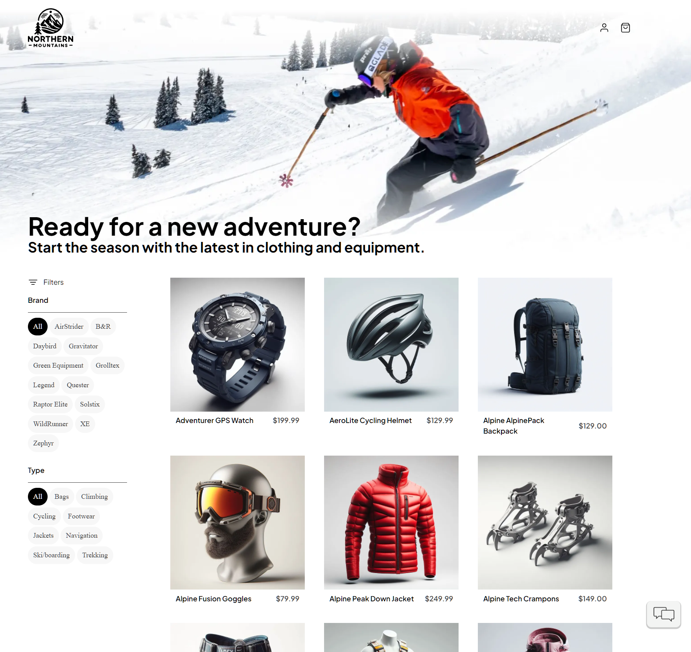

# eShop Reference Application - "AdventureWorks"

A reference .NET application implementing an e-commerce website using a services-based architecture using [.NET Aspire](https://learn.microsoft.com/dotnet/aspire/).




## Getting Started

### Prerequisites

- Clone the eShop repository: https://github.com/dotnet/eshop
- [Install & start Docker Desktop](https://docs.docker.com/engine/install/)

#### Windows with Visual Studio
- Install [Visual Studio 2022 version 17.10 or newer](https://visualstudio.microsoft.com/vs/).
  - Select the following workloads:
    - `ASP.NET and web development` workload.
    - `.NET Aspire SDK` component in `Individual components`.
    - Optional: `.NET Multi-platform App UI development` to run client apps

Or

- Run the following commands in a Powershell & Terminal running as `Administrator` to automatically configure your environment with the required tools to build and run this application. (Note: A restart is required and included in the script below.)

```powershell
install-Module -Name Microsoft.WinGet.Configuration -AllowPrerelease -AcceptLicense -Force
$env:Path = [System.Environment]::GetEnvironmentVariable("Path","Machine") + ";" + [System.Environment]::GetEnvironmentVariable("Path","User")
get-WinGetConfiguration -file .\.configurations\vside.dsc.yaml | Invoke-WinGetConfiguration -AcceptConfigurationAgreements
```

Or

- From Dev Home go to `Machine Configuration -> Clone repositories`. Enter the URL for this repository. In the confirmation screen look for the section `Configuration File Detected` and click `Run File`.

#### Mac, Linux, & Windows without Visual Studio
- Install the latest [.NET 8 SDK](https://dot.net/download?cid=eshop)
- Install the [.NET Aspire workload](https://learn.microsoft.com/dotnet/aspire/fundamentals/setup-tooling?tabs=dotnet-cli%2Cunix#install-net-aspire) with the following commands:
```powershell
dotnet workload update
dotnet workload install aspire
dotnet restore eShop.Web.slnf
```

Or

- Run the following commands in a Powershell & Terminal running as `Administrator` to automatically configuration your environment with the required tools to build and run this application. (Note: A restart is required after running the script below.)

##### Install Visual Studio Code and related extensions
```powershell
install-Module -Name Microsoft.WinGet.Configuration -AllowPrerelease -AcceptLicense  -Force
$env:Path = [System.Environment]::GetEnvironmentVariable("Path","Machine") + ";" + [System.Environment]::GetEnvironmentVariable("Path","User")
get-WinGetConfiguration -file .\.configurations\vscode.dsc.yaml | Invoke-WinGetConfiguration -AcceptConfigurationAgreements
```

> Note: These commands may require `sudo`

- Optional: Install [Visual Studio Code with C# Dev Kit](https://code.visualstudio.com/docs/csharp/get-started)
- Optional: Install [.NET MAUI Workload](https://learn.microsoft.com/dotnet/maui/get-started/installation?tabs=visual-studio-code)

> Note: When running on Mac with Apple Silicon (M series processor), Rosetta 2 for grpc-tools. 

### Running the solution

> [!WARNING]
> Remember to ensure that Docker is started

* (Windows only) Run the application from Visual Studio:
 - Open the `eShop.Web.slnf` file in Visual Studio
 - Ensure that `eShop.AppHost.csproj` is your startup project
 - Hit Ctrl-F5 to launch Aspire

* Or run the application from your terminal:
```powershell
dotnet run --project src/eShop.AppHost/eShop.AppHost.csproj
```
then look for lines like this in the console output in order to find the URL to open the Aspire dashboard:
```sh
Login to the dashboard at: http://localhost:19888/login?t=uniquelogincodeforyou
```

> You may need to install ASP.NET Core HTTPS development certificates first, and then close all browser tabs. Learn more at https://aka.ms/aspnet/https-trust-dev-cert

### Azure Open AI

When using Azure OpenAI, inside *eShop.AppHost/appsettings.json*, add the following section:

```json
  "ConnectionStrings": {
    "OpenAi": "Endpoint=xxx;Key=xxx;"
  }
```

Replace the values with your own. Then, in the eShop.AppHost *Program.cs*, set this value to **true**

```csharp
bool useOpenAI = false;
```

Here's additional guidance on the [.NET Aspire OpenAI component](https://learn.microsoft.com/dotnet/aspire/azureai/azureai-openai-component?tabs=dotnet-cli). 

### Use Azure Developer CLI

You can use the [Azure Developer CLI](https://aka.ms/azd) to run this project on Azure with only a few commands. Follow the next instructions:

- Install the latest or update to the latest [Azure Developer CLI (azd)](https://aka.ms/azure-dev/install).
- Log in `azd` (if you haven't done it before) to your Azure account:
```sh
azd auth login
```
- Initialize `azd` from the root of the repo.
```sh
azd init
```
- During init:
  - Select `Use code in the current directory`. Azd will automatically detect the .NET Aspire project.
  - Confirm `.NET (Aspire)` and continue.
  - Select which services to expose to the Internet (exposing `webapp` is enough to test the sample).
  - Finalize the initialization by giving a name to your environment.

- Create Azure resources and deploy the sample by running:
```sh
azd up
```
Notes:
  - The operation takes a few minutes the first time it is ever run for an environment.
  - At the end of the process, `azd` will display the `url` for the webapp. Follow that link to test the sample.
  - You can run `azd up` after saving changes to the sample to re-deploy and update the sample.
  - Report any issues to [azure-dev](https://github.com/Azure/azure-dev/issues) repo.
  - [FAQ and troubleshoot](https://learn.microsoft.com/azure/developer/azure-developer-cli/troubleshoot?tabs=Browser) for azd.

## Contributing

For more information on contributing to this repo, read [the contribution documentation](./CONTRIBUTING.md) and [the Code of Conduct](CODE-OF-CONDUCT.md).

### Sample data

The sample catalog data is defined in [catalog.json](https://github.com/dotnet/eShop/blob/main/src/Catalog.API/Setup/catalog.json). Those product names, descriptions, and brand names are fictional and were generated using [GPT-35-Turbo](https://learn.microsoft.com/en-us/azure/ai-services/openai/how-to/chatgpt), and the corresponding [product images](https://github.com/dotnet/eShop/tree/main/src/Catalog.API/Pics) were generated using [DALL·E 3](https://openai.com/dall-e-3).

## eShop on Azure

For a version of this app configured for deployment on Azure, please view [the eShop on Azure](https://github.com/Azure-Samples/eShopOnAzure) repo.
