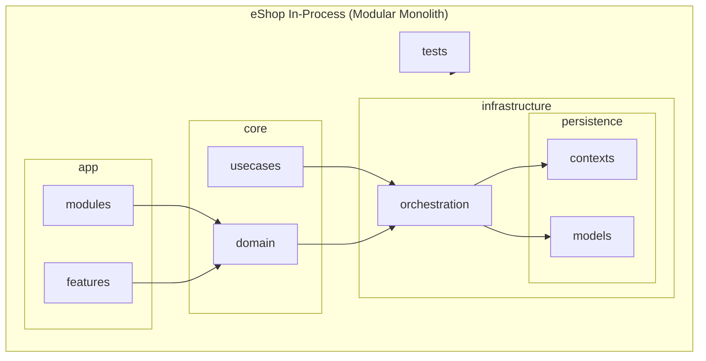
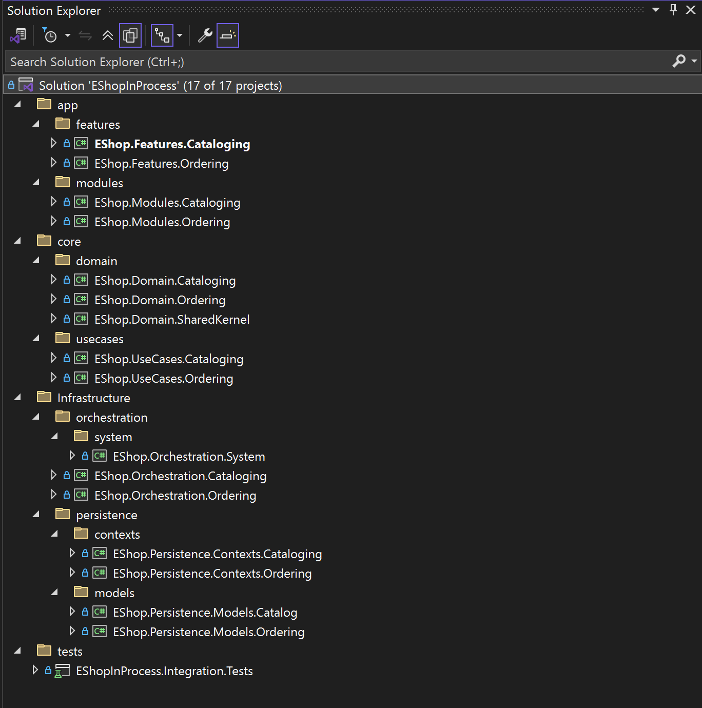

# EShop in Process using Orchestration in a Modular Monolith  

+--------------------------------------------------------------+
|                       Domain Layer                           |
|--------------------------------------------------------------|
|  - Aggregates                                                |
|  - Entities                                                  |
|  - Value Objects                                             |
|  - Domain Policies                                           |
|  - Domain Events                                             |
+-------------------------------^------------------------------+
                                |
                                |  Pure business logic
                                |
+-------------------------------|------------------------------+
|                   Application (Use Cases)                    |
|--------------------------------------------------------------|
|  - Input DTOs                                                |
|  - Output DTOs                                               |
|  - Ports (Interfaces)                                        |
|  - Use Case (Application) Services                                         |
|  - Validation                                                |
+-------------------------------v------------------------------+
                                |
                                |  Calls orchestrators through
                                |  IOrchestratorHandler
                                |
+-------------------------------|------------------------------+
|                     Orchestration Layer                      |
|--------------------------------------------------------------|
|  - Orchestrators                                              |
|      * Coordinates infrastructure flows                       |
|      * Multi-context sequencing                               |
|      * Transaction fabric                                     |
|      * EF Core + SQL pipelines                                |
|      * No domain logic                                        |
|  - Maps Input -> Infra Ops -> Output                          |
+-------------------------------v------------------------------+
                                |
                                |  Executes EF/SQL operations
                                |  through DataArc builders
                                |
+-------------------------------|------------------------------+
|                     Infrastructure Layer                      |
|--------------------------------------------------------------|
|  - EF Core DbContexts (multiple persistence boundaries)       |
|  - SQL Pipeline Builders                                      |
|  - Database Command Builders                                  |
|  - Database Query Builders                                    |
|  - External Systems (Email, File IO, APIs)                    |
|  - DDL Builder (schema evolution)                             |
+--------------------------------------------------------------+

This architecture uses DataArc Orchestration-style coordination to unify multiple persistence boundaries inside a modular monolith.

---

What Orchestration Actually Does

Orchestration is infrastructure coordination.  
It is responsible for:

- SQL pipelines
- EF Core operations
- Multi-DbContext coordination
- Transaction fabric
- Context switching
- Schema generation
- Batch operations
- SQL -> EF -> SQL sequences
- External infrastructure events

These are all pure infrastructure concerns, not domain or application logic.

---

Why Orchestrators Belong in Infrastructure

Orchestrators sit alongside other infrastructure utilities such as:

- Repositories
- Message brokers
- Database gateways
- File system implementations
- Email senders
- External API clients

Orchestrators coordinate infrastructure; they do not run domain behavior.

---

