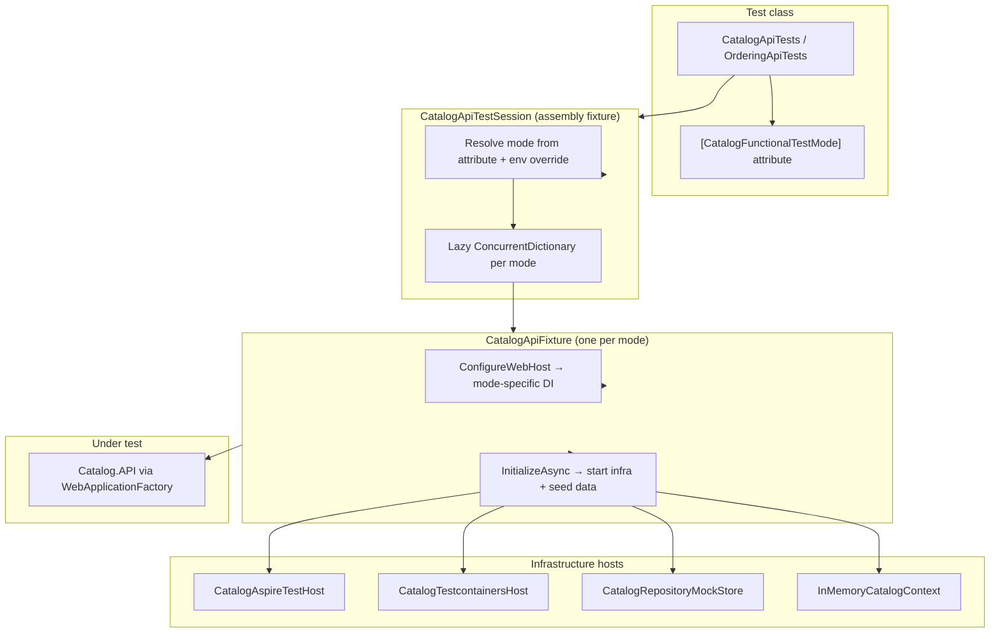

# eShop Multi-Mode Functional Testing

> Architecture and design reference for eShop's pluggable functional test infrastructure,
> covering test modes, messaging validation, and related production changes.

---

## Overview

eShop functional tests use a **pluggable test-mode architecture** shared across Catalog and Ordering microservices. The main themes are:

1. **Multi-mode test infrastructure** (Aspire, mocks, in-memory EF, Testcontainers)
2. **Messaging/outbox integration tests** (RabbitMQ + transactional outbox)
3. **Catalog API repository extraction** (to enable swappable persistence in tests)
4. **Structured logging** (Serilog in production + rich test logging)
5. **Integration event discovery fix** (works under test host)

---

## Feature 1: Multi-Mode Functional Test Framework

### What Changed

The old pattern — one `WebApplicationFactory` fixture hard-wired to Aspire + PostgreSQL — was replaced with a **pluggable test-mode architecture** shared across Catalog and Ordering.

| Before | After |
|--------|-------|
| Single `CatalogApiFixture` / `OrderingApiFixture` at project root | Mode-aware fixtures under `Fixture/` |
| Always Aspire + Docker | 4–6 modes per service |
| `IClassFixture<...>` per test class | `CatalogApiTestSession` / `OrderingApiTestSession` as assembly fixture |
| Hard-coded DB assertions | Persistence helpers that work per mode |

### Test Modes

| Mode | Infrastructure | Persistence | External Deps |
|------|----------------|-------------|---------------|
| **Aspire** (default) | Aspire DistributedApplication + pgvector Postgres | Real PostgreSQL | Fake AI, no-op event bus |
| **RepositoryMock** | `WebApplicationFactory` only | In-memory store via `ICatalogRepository` / Ordering repos | All mocked |
| **EfCoreInMemory** | `WebApplicationFactory` | EF Core InMemory + production repository impl | Fake AI, no-op event bus |
| **Testcontainers** | Testcontainers.PostgreSql | Real PostgreSQL in container | Fake AI, no-op event bus |
| **AspireMessagingOutbox** | Aspire + Postgres | Real PostgreSQL | `CapturingEventBus` spy instead of RabbitMQ |
| **AspireMessagingRabbitMq** | Aspire + Postgres + RabbitMQ | Real PostgreSQL | Real RabbitMQ + capture handlers |

### Architecture (How It Works)



**Key flow per test method:**

1. `[CatalogFunctionalTestMode(...)]` declares required mode and exposes an xUnit trait (`FunctionalTestMode=mock|inmemory|testcontainers|aspire|...`).
2. `CatalogApiTestSession.CreateHostAsync()` resolves the mode (attribute wins unless env var overrides).
3. A fixture is created **lazily once per mode** and reused across tests.
4. Returns `CatalogApiTestHost` with a logged `HttpClient` and access to the fixture for persistence checks.

### New File Structure

```
tests/
├── Testing.Common/                    # NEW shared test library
│   ├── TestLogging.cs                 # Console + test output logging
│   ├── HttpTrafficLoggingHandler.cs   # HTTP request/response tracing
│   ├── MSTestLoggingTestBase.cs       # Base for MSTest unit tests
│   └── Messaging/
│       ├── CapturingEventBus.cs       # Spy IEventBus
│       ├── IntegrationEventCapture.cs # RabbitMQ handler capture
│       └── OutboxAssertions.cs        # Query IntegrationEventLogEntry
│
├── Catalog.FunctionalTests/
│   ├── Fixture/                       # Session, mode enum, attributes, traits
│   ├── Configuration/                 # DI wiring per mode
│   ├── Infrastructure/                # Aspire/Testcontainers hosts, DB helpers
│   ├── Mocks/                         # FakeCatalogAI, InMemoryCatalogRepository, etc.
│   ├── CatalogApiTests.cs             # Refactored API tests
│   └── CatalogMessagingTests.cs       # NEW outbox/RabbitMQ tests
│
└── Ordering.FunctionalTests/          # Mirror structure for Ordering
```

### How to Run

```bash
# Fast local run (no Docker) — via default .runsettings
dotnet test tests/Catalog.FunctionalTests --settings eShop.FunctionalTests.runsettings

# Full integration
dotnet test tests/Catalog.FunctionalTests --settings eShop.FunctionalTests.Aspire.runsettings

# Filter by mode trait
dotnet test tests/Catalog.FunctionalTests --filter-trait FunctionalTestMode=mock
dotnet test tests/Ordering.FunctionalTests --filter-trait FunctionalTestMode=testcontainers
dotnet test tests/Ordering.FunctionalTests --filter-trait FunctionalTestMode=aspire
```

Trait values: `mock`, `inmemory`, `testcontainers`, `aspire`, `aspire-messaging-outbox`, `aspire-messaging-rabbitmq`.

### Runsettings Files (Repo Root)

| File | Sets |
|------|------|
| `eShop.FunctionalTests.runsettings` | Both services → `Mock` |
| `eShop.FunctionalTests.Aspire.runsettings` | Both → `Aspire` |
| `eShop.FunctionalTests.RepositoryMock.runsettings` | Mock mode |
| `eShop.FunctionalTests.EfCoreInMemory.runsettings` | In-memory EF |
| `eShop.FunctionalTests.Testcontainers.runsettings` | Testcontainers |
| `eShop.FunctionalTests.AspireMessagingOutbox.runsettings` | Outbox spy tests |
| `eShop.FunctionalTests.AspireMessagingRabbitMq.runsettings` | RabbitMQ tests |

**Environment variables:** `ESHOP_CATALOG_FUNCTIONAL_TEST_MODE`, `ESHOP_ORDERING_FUNCTIONAL_TEST_MODE`.

When no environment override is set, each test uses the mode from its attribute and fixtures are created lazily per mode. Setting the env var overrides the attributed mode for all executed tests and skips tests whose attribute does not match.

### Selecting a Mode Per Test

Annotate a test class or individual test method with `[CatalogFunctionalTestMode(...)]` or `[OrderingFunctionalTestMode(...)]`. Method-level attributes override class-level defaults. Unmarked tests default to `Aspire`.

```csharp
[CatalogFunctionalTestMode(CatalogFunctionalTestMode.RepositoryMock)]
public sealed class CatalogApiTests(CatalogApiTestSession session) { ... }

[Fact]
[OrderingFunctionalTestMode(OrderingFunctionalTestMode.Testcontainers)]
public async Task MyIntegrationTest() { ... }
```

---

## Feature 2: Messaging & Outbox Integration Tests

### What Changed

New test classes validate the **transactional outbox pattern** end-to-end:

- **Catalog:** price update → `ProductPriceChangedIntegrationEvent`
- **Ordering:** create order → `OrderStartedIntegrationEvent` + `OrderStatusChangedToSubmittedIntegrationEvent`

### Two Verification Strategies

**1. Outbox + spy bus (`AspireMessagingOutbox`)**

- Removes RabbitMQ hosted services
- Registers `CapturingEventBus` as `IEventBus`
- Asserts both:
  - Outbox table rows (`OutboxAssertions.GetPublishedEventsAsync<TContext>`)
  - Events passed to the spy bus

**2. Real RabbitMQ (`AspireMessagingRabbitMq`)**

- Aspire spins up RabbitMQ alongside Postgres
- `IntegrationEventCaptureHandler` subscribes and collects deserialized events
- `WaitForCountAsync()` polls until expected events arrive
- Still verifies outbox persistence

This gives a blog-friendly story: **same business test, two levels of messaging fidelity**.

---

## Feature 3: Catalog Repository Pattern (Production Refactor)

### What Changed

Data access was extracted from minimal API handlers into a repository abstraction.

**New files:**

- `src/Catalog.API/Infrastructure/Repositories/ICatalogRepository.cs`
- `src/Catalog.API/Infrastructure/Repositories/CatalogRepository.cs`

**Modified:**

- `CatalogApi.cs` — all EF queries moved behind `ICatalogRepository`
- `CatalogServices.cs` — injects `ICatalogRepository` instead of `CatalogContext`
- `Extensions.cs` — `services.AddScoped<ICatalogRepository, CatalogRepository>()`
- `CatalogContext.cs` — constructor accepts `DbContextOptions` (not `DbContextOptions<CatalogContext>`) so in-memory test contexts can substitute

### Why It Matters Architecturally

This is the **enabler** for `RepositoryMock` mode: tests swap `CatalogRepository` for `InMemoryCatalogRepository` without changing API code.

### Notable Behavior Change in Updates

Price-change detection no longer relies on EF change tracking:

```csharp
// Before: priceEntry.IsModified via EF Entry API
// After: explicit property copy + compare originalPrice != productToUpdate.Price
```

A new private `UpdateCatalogItem()` copies properties explicitly. This makes updates work consistently whether persistence is EF-tracked or in-memory.

### ICatalogRepository Surface

- `GetItemsAsync` — paginated, filtered list
- `GetItemsByIdsAsync`
- `GetItemByIdAsync` (optional brand include)
- `GetTypesAsync` / `GetBrandsAsync`
- `GetItemsBySemanticRelevanceAsync` / `GetItemsBySemanticRelevanceWithDistanceAsync`
- `GetItemsCountAsync`
- `AddAsync` / `Remove` / `SaveChangesAsync`

---

## Feature 4: Serilog Structured Logging (Production)

### What Changed

| File | Change |
|------|--------|
| `src/eShop.ServiceDefaults/LoggingExtensions.cs` | **NEW** — `AddSerilogLogging()` |
| `src/eShop.ServiceDefaults/Extensions.cs` | Calls `AddSerilogLogging()` in service defaults pipeline |
| `src/eShop.ServiceDefaults/eShop.ServiceDefaults.csproj` | Serilog packages |
| `src/Catalog.API/appsettings.json` | Serilog minimum level config |
| `src/Ordering.API/appsettings.json` | Same |
| `Directory.Packages.props` | Serilog + console logging packages |

### How It Works

- Reads from `IConfiguration` (`Serilog` section in appsettings)
- Enriches with `Application` property and log context
- Console output in Development, `Build`, and `Testing` environments (or when `Logging:EnableConsole=true`)
- Optional bridge to `ILogger` providers via `Logging:WriteToProviders`

Tests reuse this via `TestLogging.ConfigureTestLogging()` with debug-level filters and test-output providers.

---

## Feature 5: Integration Event Type Discovery Fix

**File:** `src/IntegrationEventLogEF/Services/IntegrationEventLogService.cs`

**Before:** Scanned only `Assembly.GetEntryAssembly()` for `*IntegrationEvent` types.

**After:** Scans all non-dynamic loaded assemblies in the AppDomain, with `ReflectionTypeLoadException` handling.

**Why:** Under `WebApplicationFactory`, the entry assembly is often the **test assembly**, not Catalog.API/Ordering.API. Event deserialization in outbox assertions would fail without this fix.

---

## Feature 6: Test Logging & Observability Infrastructure

### New Capabilities in `Testing.Common`

| Component | Purpose |
|-----------|---------|
| `TestLogging` | Central config for test host logging, logger factories, test boundaries |
| `TestOutputLoggerProvider` | Routes `ILogger` to xUnit/MSTest output |
| `HttpTrafficLoggingHandler` | Logs HTTP traffic through test clients |
| `FlushTestLogsAttribute` | xUnit before/after hook to flush captured logs |
| `MSTestLoggingTestBase` | MSTest `[TestInitialize]` wiring for unit tests |

### xUnit Assembly Setup

```csharp
[assembly: Xunit.CaptureConsole]
[assembly: Xunit.CaptureTrace]
[assembly: AssemblyFixture(typeof(CatalogApiTestSession))]
```

`testconfig.json` enables `"showLiveOutput": true` for live test output in the MTP runner.

---

## Feature 7: Test Assertion & Data Quality Improvements

### Catalog Tests

- Removed hard-coded `103` item count → `host.Fixture.GetPersistedCatalogItemCountAsync()`
- Added persistence verification after create/update (`LoadPersistedCatalogItemAsync`)
- Per-test host creation via `[CallerMemberName]` for isolation

### Ordering Tests

- `AddNewOrder` now asserts order count before/after
- Fixed `CreateOrderRequest` with complete address fields and future card expiration
- `GetStoredOrdersWithOrderId` uses non-existent ID `999999` to avoid cross-test pollution

### Unit Test Sample

`NewOrderCommandHandlerTest` now extends `MSTestLoggingTestBase` and uses real test loggers instead of NSubstitute for `ILogger`.

---

## Feature 8: Build & Dependency Changes

**`Directory.Packages.props` additions:**

- `Microsoft.EntityFrameworkCore.InMemory`
- `Testcontainers.PostgreSql`
- `Aspire.Hosting.RabbitMQ` (via csproj refs)
- Serilog stack (`Serilog.AspNetCore`, `Serilog.Extensions.Logging`, `Serilog.Settings.Configuration`, `Serilog.Sinks.Console`)
- `MSTest.TestFramework`, `xunit.v3.common`

**`tests/Directory.Build.props`:**

- All test projects (except `Testing.Common`) auto-reference `Testing.Common`

**Solution files:**

- `eShop.slnx` and `eShop.Web.slnf` include `tests/Testing.Common`

**Test project deps:**

- Both functional test projects add EF InMemory, Testcontainers, Aspire RabbitMQ hosting, and `testconfig.json` copy-to-output

---

## Complete File Inventory

### Modified Tracked Files (24)

| Area | Files |
|------|-------|
| Build | `Directory.Packages.props`, `eShop.slnx`, `eShop.Web.slnf`, `tests/Directory.Build.props` |
| Catalog API | `Apis/CatalogApi.cs`, `Extensions/Extensions.cs`, `GlobalUsings.cs`, `Infrastructure/CatalogContext.cs`, `Model/CatalogServices.cs`, `appsettings.json` |
| Shared infra | `IntegrationEventLogEF/Services/IntegrationEventLogService.cs`, `eShop.ServiceDefaults/Extensions.cs`, `eShop.ServiceDefaults.csproj` |
| Ordering | `Ordering.API/appsettings.json` |
| Tests | `Catalog.FunctionalTests.csproj`, `CatalogApiTests.cs`, `Ordering.FunctionalTests.csproj`, `OrderingApiTests.cs`, `Basket.UnitTests/GlobalUsings.cs`, `Ordering.UnitTests/GlobalUsings.cs`, `Ordering.UnitTests/Application/NewOrderCommandHandlerTest.cs`, `tests/README.md` |

### Deleted & Replaced

- `tests/Catalog.FunctionalTests/CatalogApiFixture.cs` → rewritten under `Fixture/`
- `tests/Ordering.FunctionalTests/OrderingApiFixture.cs` → rewritten under `Fixture/`

### New Source (Untracked)

| Path | Role |
|------|------|
| `tests/Testing.Common/**` | Shared test utilities + messaging helpers |
| `src/Catalog.API/Infrastructure/Repositories/**` | Repository abstraction |
| `src/eShop.ServiceDefaults/LoggingExtensions.cs` | Serilog setup |
| `eShop.FunctionalTests*.runsettings` (7 files) | VS/CLI mode presets |
| `tests/Catalog.FunctionalTests/AssemblyInfo.cs` | xUnit assembly fixtures + console capture |
| `tests/Catalog.FunctionalTests/FlushTestLogsAttribute.cs` | Log flush hook |
| `tests/Catalog.FunctionalTests/testconfig.json` | xUnit live output config |
| `tests/Catalog.FunctionalTests/{Fixture,Configuration,Infrastructure,Mocks}/**` | Catalog test infrastructure |
| `tests/Catalog.FunctionalTests/CatalogMessagingTests.cs` | Messaging tests |
| `tests/Ordering.FunctionalTests/AssemblyInfo.cs` | xUnit assembly fixtures |
| `tests/Ordering.FunctionalTests/FlushTestLogsAttribute.cs` | Log flush hook |
| `tests/Ordering.FunctionalTests/testconfig.json` | xUnit live output config |
| `tests/Ordering.FunctionalTests/{Fixture,Configuration,Infrastructure,Mocks}/**` | Ordering test infrastructure |
| `tests/Ordering.FunctionalTests/OrderingMessagingTests.cs` | Messaging tests |

### Incidental / Likely Noise

- `src/ClientApp/Services/Basket/Protos/*.cs` — line-ending only (no content diff)
- `.vs/`, `artifacts/` — build/IDE output, not intentional changes

---

## Architecture Narrative (Blog Angle)

> **"Testing microservices at the speed you need"**

The work introduces a **test fidelity ladder**:

```
RepositoryMock  →  fastest, no Docker, tests API + domain logic
EfCoreInMemory  →  tests real EF repository code, still no Docker
Testcontainers  →  real PostgreSQL, no full Aspire orchestration
Aspire          →  closest to production topology (Postgres + pgvector)
Messaging modes →  validates transactional outbox + optional real RabbitMQ
```

Production changes (`ICatalogRepository`, Serilog, event type discovery) exist **because** the test infrastructure demanded them — repository swappability, readable logs during failures, and correct outbox deserialization in the test host.

---

## Suggested Blog Post Sections

1. **Problem:** Functional tests were Docker-only, slow, and hard to debug
2. **Design:** Mode attribute + session + lazy fixture per mode
3. **Implementation walkthrough:** Catalog fixture switch statement and DI configuration
4. **Repository extraction:** Why Catalog.API needed `ICatalogRepository`
5. **Messaging tests:** Outbox spy vs real RabbitMQ
6. **Developer experience:** Runsettings, traits, live logging, HTTP traffic traces
7. **Results:** Run mock tests locally in seconds; run Aspire tests in CI

---

## Ordering-Specific Notes

`Ordering.FunctionalTests` mirrors the Catalog structure with service-specific mocks:

- `OrderingRepositoryMockStore` with in-memory repos for orders, buyers, request manager
- `MockIdentityService` and `AutoAuthorizeStartupFilter` for auth bypass
- Aspire host includes Identity API + IdentityDB alongside OrderingDB
- Card types seeded in mock store (no EF database seeding in mock mode)

---

## Catalog-Specific Notes

- Aspire host uses `ankane/pgvector` image for vector search tests
- `FakeCatalogAI` replaces Ollama/embedding services in non-production test modes
- `NoOpCatalogIntegrationEventService` and `NoOpIntegrationEventLogService` skip messaging in standard API tests
- Messaging modes re-enable real outbox + bus/capture infrastructure
