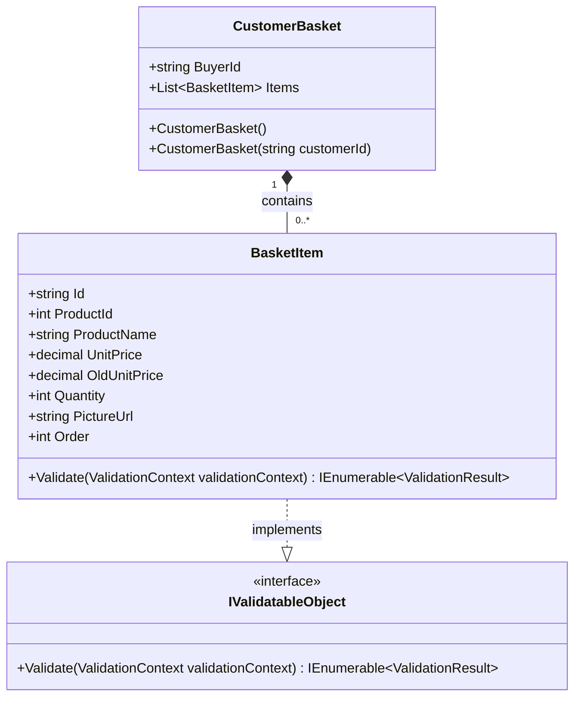

```mermaid
classDiagram
    class CustomerBasket {
        +string BuyerId
        +List~BasketItem~ Items
        +CustomerBasket()
        +CustomerBasket(string customerId)
    }

    class BasketItem {
        +string Id
        +int ProductId
        +string ProductName
        +decimal UnitPrice
        +decimal OldUnitPrice
        +int Quantity
        +string PictureUrl
        +int Order
        +Validate(ValidationContext validationContext) IEnumerable~ValidationResult~
    }

    class IValidatableObject {
        <<interface>>
        +Validate(ValidationContext validationContext) IEnumerable~ValidationResult~
    }

    CustomerBasket "1" *-- "0..*" BasketItem : contains
    BasketItem ..|> IValidatableObject : implements
```
