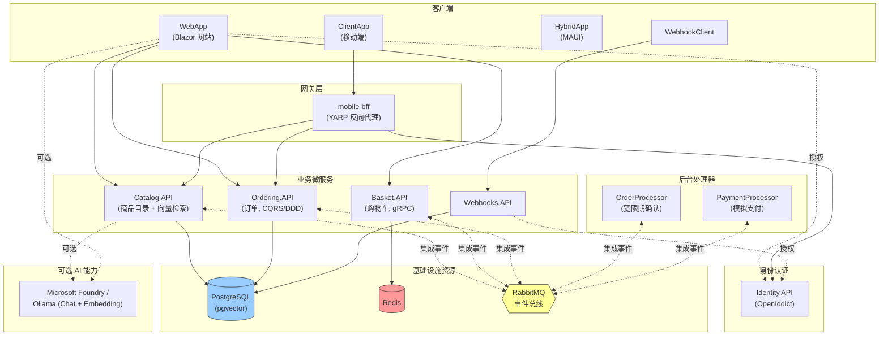
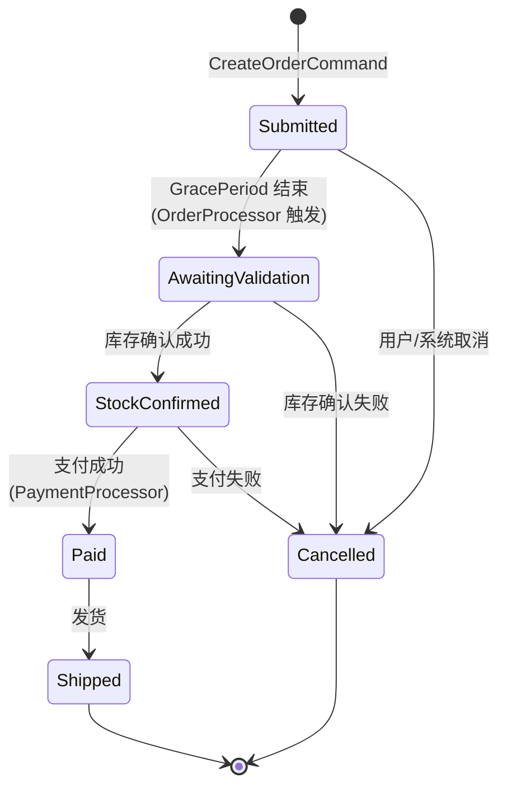
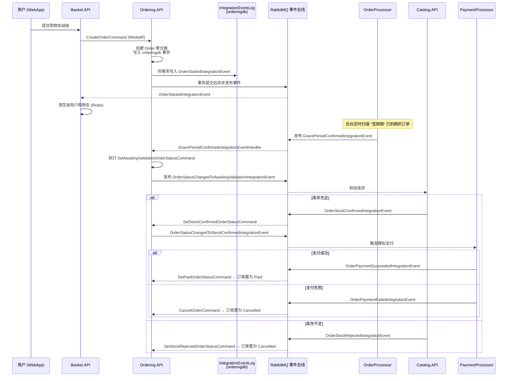
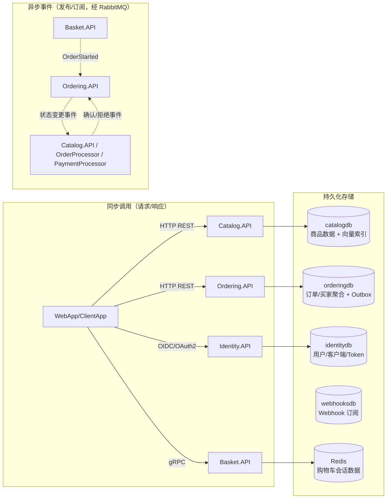

# eShop 项目概览

> 本文档面向希望快速理解 [dotnet/eShop](https://github.com/dotnet/eShop) 参考应用的开发者，涵盖项目定位、核心组织结构、系统架构以及关键业务流 / 数据流。

## 1. 项目定位

eShop（代号 "AdventureWorks"）是微软官方维护的 **.NET 参考应用**，用于演示如何用 **.NET Aspire** 构建基于微服务（服务化）架构的电商网站。它不是一个生产级商用系统，而是一套教学/示例代码，重点展示：

- 微服务拆分与领域驱动设计（DDD）实践（尤其体现在 `Ordering` 服务）
- 服务间通过 **RabbitMQ 事件总线** 实现的**异步集成事件（Integration Events）** 与 **Outbox 模式**
- 用 **.NET Aspire** 统一编排本地开发环境（容器、数据库、消息队列、服务发现、健康检查、遥测）
- 一套前端应用（Blazor Web App）+ 一套移动端 BFF（YARP 反向代理）+ 身份认证（OpenIddict）

技术栈：.NET 10、ASP.NET Core、Blazor、Entity Framework Core、PostgreSQL（含 pgvector 向量检索）、Redis、RabbitMQ、gRPC、MediatR（CQRS）、YARP、OpenIddict、.NET Aspire。

## 2. 核心组织结构（`src/` 目录）

| 目录 | 角色 | 说明 |
|---|---|---|
| `eShop.AppHost` | **编排入口** | Aspire AppHost，声明所有资源（数据库、缓存、消息队列）与服务及其依赖关系，是本地/云端启动的唯一入口 |
| `eShop.ServiceDefaults` | 公共基础设施 | 所有服务共享的默认配置：健康检查、OpenTelemetry、服务发现、弹性策略（Resilience） |
| `Identity.API` | 认证服务 | 基于 OpenIddict 的身份认证/授权中心（OAuth2/OIDC），签发 Token 给其他服务和前端 |
| `Catalog.API` | 商品目录服务 | 商品/品牌/分类的 CRUD，PostgreSQL + pgvector 支持语义（向量）搜索，发布/订阅集成事件 |
| `Basket.API` | 购物车服务 | gRPC 接口，Redis 存储购物车数据，监听 `OrderStarted` 事件清空购物车 |
| `Ordering.API` | 订单服务（核心） | CQRS + DDD，MediatR 命令/查询分离，订单状态机，发布订单相关集成事件（Outbox 模式） |
| `Ordering.Domain` | 订单领域模型 | 聚合根 `Order`、`Buyer`，领域事件（Domain Events），业务规则 |
| `Ordering.Infrastructure` | 订单基础设施 | EF Core 仓储实现、数据库配置 |
| `OrderProcessor` | 订单后台处理器 | 定时任务，模拟"宽限期"确认（GracePeriod），推动订单从草稿态进入已提交态 |
| `PaymentProcessor` | 支付模拟服务 | 订阅 `OrderStatusChangedToStockConfirmed` 事件，模拟支付成功/失败并回发事件 |
| `Webhooks.API` / `WebhookClient` | Webhook 示例 | 演示对外 Webhook 注册与回调机制 |
| `EventBus` / `EventBusRabbitMQ` | 事件总线抽象与实现 | 定义 `IntegrationEvent`、`IEventBus` 抽象，RabbitMQ 具体实现（含遥测、重连） |
| `IntegrationEventLogEF` | Outbox 组件 | 集成事件持久化日志，保证"数据库事务 + 事件发布"的一致性（Transactional Outbox） |
| `WebApp` | 主 Web 前端 | Blazor（SSR/交互式）应用，面向终端用户的电商网站 |
| `WebAppComponents` | 共享 UI 组件 | `WebApp` 与 `HybridApp` 复用的 Razor 组件库 |
| `HybridApp` | .NET MAUI 混合应用 | 移动/桌面客户端，复用 `WebAppComponents` |
| `ClientApp` | 移动端原生客户端 | 通过 `mobile-bff`（YARP）访问后端 API |
| `Shared` | 公共 DTO/工具 | 跨服务共享的模型与工具类 |

`tests/` 目录包含单元测试、服务级测试、以及 `e2e/`（Playwright）端到端测试。

## 3. 系统架构图

**编排方式**：`eShop.AppHost/Program.cs` 是唯一的"总装配"入口，使用 Aspire 的资源构建器 API 声明式地：

1. 创建基础设施资源：`redis`、`eventbus`(RabbitMQ)、`postgres`（4 个数据库：`catalogdb`/`identitydb`/`orderingdb`/`webhooksdb`）；
2. 创建各服务项目资源，并用 `.WithReference()` / `.WaitFor()` 声明依赖与启动顺序（例如 `order-processor` 要等待 `ordering-api` 完成 EF 迁移）；
3. 通过环境变量把服务发现信息（如 `Identity__Url`、`CallBackUrl`）注入各服务；
4. 用 YARP 搭建 `mobile-bff`，为移动端提供聚合路由（商品/订单/身份三类路由转发）；
5. 可选启用 Microsoft Foundry 或 Ollama，为 `Catalog.API`（语义搜索的 Embedding）和 `WebApp`（AI 聊天助手）提供模型能力。

## 4. 核心业务流：下单流程（Checkout → Order 状态机）

订单服务 (`Ordering.API`/`Ordering.Domain`) 采用 **CQRS（MediatR 命令/查询分离）+ DDD 聚合根 + 事件驱动状态机**，是全项目最能体现架构设计的部分。

### 4.1 订单状态机

### 4.2 端到端时序（跨服务协作）

**关键设计模式说明：**

- **CQRS**：`Ordering.API/Application/Commands` 定义写操作（`CreateOrderCommand`、`CancelOrderCommand`、`ShipOrderCommand` 等），`Application/Queries` 定义读操作，均通过 MediatR 管道调度，`Behaviors` 中实现日志、事务、验证等横切逻辑。
- **幂等命令（Idempotent Commands）**：`IdentifiedCommand`/`IdentifiedCommandHandler` 包装业务命令，通过请求 ID 去重，防止消息重复投递导致的重复下单/重复状态变更。
- **领域事件 vs 集成事件**：`Ordering.Domain/Events` 中的领域事件仅在服务内部（同一进程/同一事务）生效，触发后经由 `DomainEventHandlers` 转换为对外发布的 **集成事件**（`Application/IntegrationEvents/Events`），实现领域内部与跨服务通信的解耦。
- **Transactional Outbox（`IntegrationEventLogEF`）**：集成事件与业务数据变更在同一数据库事务中落盘（写入 `IntegrationEventLog` 表），事务提交成功后由后台流程异步发布到 RabbitMQ，避免"业务已提交但事件丢失"或"事件已发布但业务回滚"的不一致问题。
- **服务自治**：`Catalog.API` 与 `Basket.API` 都独立维护自己的数据（PostgreSQL / Redis），互不直接调用数据库，服务间只通过事件总线通信，符合微服务的"数据库自治"原则。

## 5. 数据流总览

- **同步数据流**：前端/移动端通过 REST 或 gRPC 直接请求业务服务获取实时数据（商品列表、购物车内容、订单详情），身份验证走标准 OIDC 授权码/客户端凭证流程。
- **异步数据流**：跨服务的业务状态传播（下单、扣库存、支付、发货）完全通过 RabbitMQ 集成事件驱动，每个服务只维护自己边界内的数据库，通过订阅事件更新自身状态，实现最终一致性（Eventual Consistency）。
- **AI 数据流（可选）**：启用 Foundry/Ollama 后，`Catalog.API` 在写入商品数据时调用 Embedding 模型生成向量并存入 `catalogdb`（pgvector），支持语义相似度搜索；`WebApp` 调用 Chat 模型为用户提供购物助手对话能力。

## 6. 可观测性与横切关注点

`eShop.ServiceDefaults` 为所有服务统一注入：

- **服务发现**（基于 Aspire 的 `WithReference` 自动生成的服务地址环境变量）
- **健康检查**（`/health`、`/alive` 端点，AppHost 中 `WithHttpHealthCheck` 用于编排等待）
- **OpenTelemetry**（分布式追踪、指标、日志，可在 Aspire Dashboard 中查看全链路调用）
- **弹性策略**（HTTP 客户端重试/超时，基于 `Microsoft.Extensions.Http.Resilience`）

## 7. 小结

eShop 是一套"麻雀虽小、五脏俱全"的云原生微服务参考实现：用 Aspire 解决了本地多服务编排的痛点，用 DDD + CQRS 展示了订单这种复杂业务的建模方式，用 Transactional Outbox + RabbitMQ 展示了微服务间可靠的事件驱动通信，并额外演示了 gRPC、向量检索、YARP 网关、Webhook、OpenIddict 认证等常见工程实践，适合作为学习 .NET 微服务架构的范例项目。
